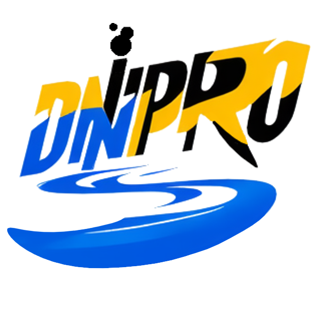
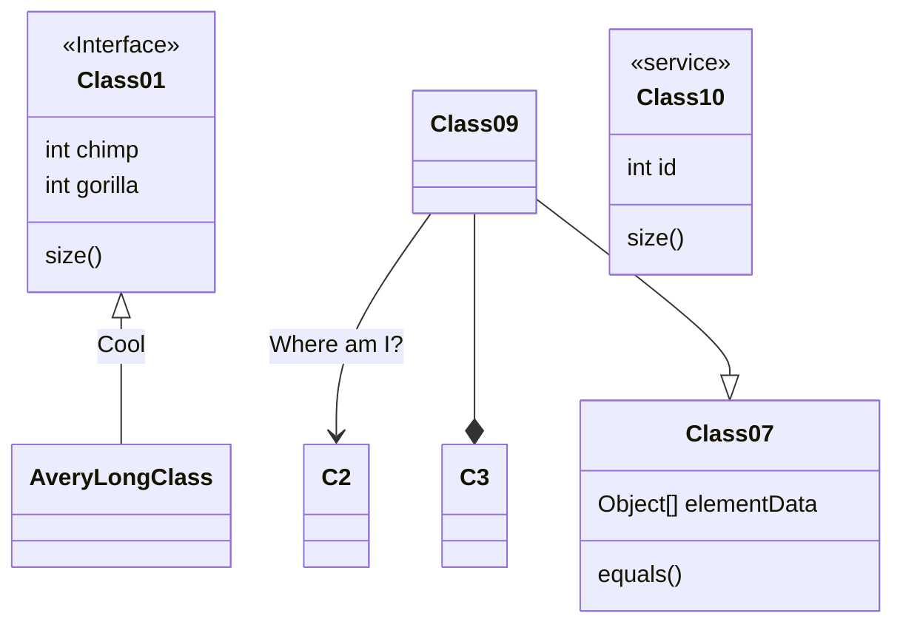

# Dnipro

Zig as the Foundation for a Portable and Modular Game Engine.

## [Draft](diploma/draft.md)

Final thesis with code implementation.

Zig compiler version is `0.13.0-dev.351+64ef45eb0`

Example [mermaid diagram](https://github.com/mermaid-js/mermaid)

Example architecture file from [rust-analyzer](https://github.com/rust-analyzer/rust-analyzer/blob/d7c99931d05e3723d878bea5dc26766791fa4e69/docs%2Fdev%2Farchitecture.md)

Example Design file from [TigerBeetle](https://github.com/tigerbeetledb/tigerbeetle/blob/fe09404d465df46b2bdfc017633eff37b4ab2343/docs%2FDESIGN.md)

---

<table align="center">
  <tr>
    <td align="center"></td>
  </tr>
  <tr>
    <td align="center"><b>⚠ My lovely country has been invaded by russia and is currently at war ⚠</b></td>
  </tr>
  <tr>
    <td align="center">Due to the matter, all activity on my repositories might be delayed</td>
  </tr>
</table>

Please consider helping Ukraine! The most effective thing you can do is donate to one of the local non-government charities that supply our defenders with critical equipment — power stations, medical supplies, armored vests, light vehicles, reconnaissance drones, weapon attachments, etc. It's best to avoid donating to global funds, such as Red Cross or UN Crisis Relief, because they have a very limited presence in Ukraine and typically can't provide the most necessary support.

Here's a list of trusted charities from r/Ukraine https://www.reddit.com/r/ukraine/wiki/charities. You can also donate to Serhii Sternenko's https://send.monobank.ua/jar/dzBdJ3737 fund, who buys fpv drones and distributes them throughout different units.
