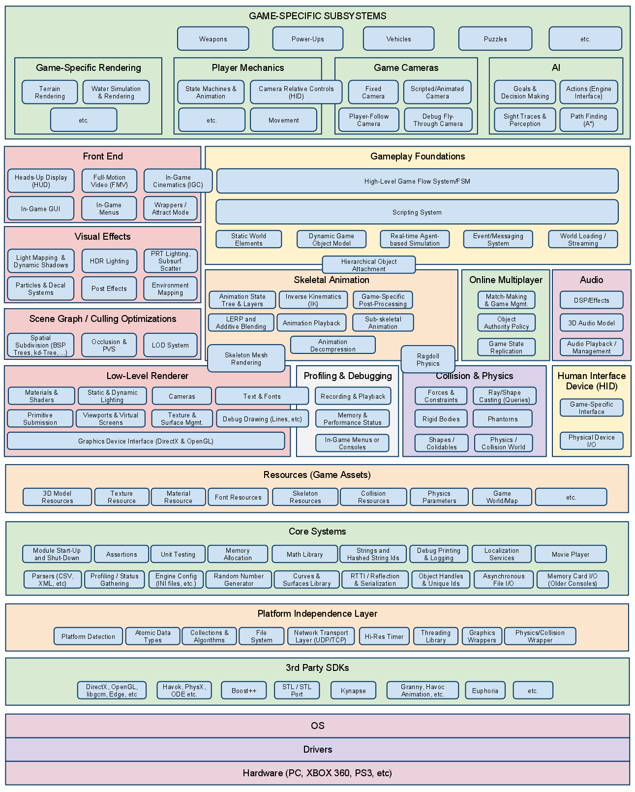

# Zig as the Foundation for a Portable and Modular Game Engine

## Introduction

Until recent years, before Indie dev boom, most of the engines were proprietary and were tightly coupled to games that were built on top of them.
Developers who wanted to create a game had to do a thorough research about a target platform and write a lot of basic functionality that is now shipped in most engines by default.
Appearance of Steam and Xbox Live Arcade in mid two thousands was one of the stepping stones for indie game development as it "pulled underground indie devs up into the sun"
by taking care of the game distribution [2].
Naturally, this caused the rise in demand for game engines.
However, most of the engines at the time were proprietary, and companies behind them weren't keen on sharing their secrets, as the industry was still in its adolescence.
As a result, they were never properly researched [5].
Almost all relevant game engines are closed source which means that particularities on implementation of certain functionalities are not available to developers.
There are some books about engines, but they don't provide high level architecture overview, only low level implementation.
Most of the recent academic works agree that not a lot is known about the game development process, and most of the information about big and successful engines
come from postmortems, blogs or other media where individual developers share their experiences.
The fact that they are not thoroughly researched nor defined yet and is a source of much frustration. [1]

Additionally, rebirth of handhelds with Nintendo Switch, Steam Deck and other platforms means that developers need to take more care about the optimization
since the computing power of those devices is more limited compared to bulky PCs and consoles.
Although the semiconductor industry has been good at identifying near and long term bottlenecks of Moor's Law [3], some chip-makers claim that Moor's Law is dead,
justifying the price hike of graphics cards [4].
Thus, it is important for developers to find new ways for optimizing their games inside the software, instead of relying on the hardware to handle the ever-increasing load.
Popular engines like Unreal and Unity allow for a faster development cycle by limiting the developer's access to the engine's underlying systems.

For these reasons, it is important to periodically evaluate the underlying tools and to look for possible improvements.
One of them could be switching to another language.
Most of the modern games are written in C++ and C [1] which allows developers to have more control over the hardware.
However, both of those languages are quite old, and were designed during a different age and for different kind of hardware that is common nowadays.
(Dedicated graphic cards did not exist and 4 kilobytes of RAM was a norm)
"It is our belief that the manner in which low-level issues influence architectural design is intrinsically linked to the fact that technology changes at a very fast rate"[15]

Game-development is a very complex process nowadays, especially in AAA studios. Generating the assets and writing the code is just a tine fraction off it.
Biggest problems that are faced during the process of game development are related to scope, feature creep, and cutting features.
Additionally, second most common kind of problem faced in the game development is technical issues [6].
Creation of a game starts from pre-production stage, with writing a game design document and scribbling the concept art.
I believe that it's during this period when a company needs to decide what kind of engine will be used judging from the core gameplay features.
A right decision here might reduce the amount of technical problems by simply removing the redundant features of general-purpose engine like Unity.

Beneficially to Estonia, it is a good opportunity to make research in a field that is currently underperforming in Europe compared to US and Japan.
This could place Estonia into a dominant place in the sphere of game engine development.

In order to find possible improvements in current game development process, the following research questions will need to be answered:
Question #1: What are the most fundamental components of a game engine? Question #2: How does a programming language impact the game development process?

To answer them the following research tasks need to be performed:
1) analyze the architecture of popular game engines and identify common components;
2) compare C, C++, Rust, Zig and Odin for language features, semantics, package management and build system;
3) analyze the suitability of Zig for game development;
4) demonstrate the feasibility with a practical example in a form of a simple 2D game.

The paper is structured as follows:

- Section 1.1 introduces us with the research in this field done so far;
- Section 1.2 is a theoretical part which explains some of the software development concepts related to game development;
- Section 2.1 compares Unity and Unreal Engine;
- Section 2.2 analyzes existing game engines;
- Section 2.3 explains the importance of a programming language;
- Section 2.4 evaluates the feasibility of creating games using a Zig language;
- Section 3 discusses our results and threats to their validity;
- Section 4 concludes.

### 1.1 Theoretical part

Most of the academic papers that touch the topic of game engines mention that there is not enough research being done on the topic [6][7][10][20].
"This lack of literature and research regarding game engine architectures is perplexing."[15 p1]
By the time of writing of this paper, several works about game engines internal architecture have been published,
however, to the best of my knowledge, none has discussed the importance of a programming language.

Anderson et al. do not perform a research, but introduce fundamental questions that need to be considered when designing the architecture of a game engine [15].
This is a great introductory resource that distills the current state of research of game engines.
They highlight the lack of proper terminology and game development "language", as well as the lack of clear boundaries between a game and its engine.
Authors encourage classifying common engine components, investigating the connection between low-level issues and top-level engine implementation,
and identifying the best practices in a field.
A paper also mentions an "Uberengine", a theoretical engine that allows to create any kind of game regardless of genre.

A comprehensive book by Gregory [12] about the engine architecture is referenced in multiple studies.
He proposes a "Runtime Engine Architecture", in which a game engine consists of 15 runtime components with a clear dependency hierarchy.
We take a close look at them and debate possible modifications in Section 2.2.
This book finds an optimal middle ground between a high-level, broad description of how those modules interact with each other, and their detailed implementations.
Most of the examples are written in C++ and are object-oriented in nature, however.

Ullmann et al. [13] used this model as a target reference when exploring the architecture of three popular open source game engines (Cocos2d-x, Godot, and Urho3D).
They added a separate World Editor (EDI) subsystem "because it [World Editor] directly impacts game developers’ work."
Godot was found to have all 16 out of 16 subsystems, while Cocos2d-x and Urcho3D 13 and 12 respectively.
However, the missing functionality was not absent, but rather scattered among other subsystems.
They also found which subsystems are more often coupled with one another: COR, SGC and LLR.
COR file are helper tools that are used throughout the system.
"Video games are highly dependent on visuals, and graphics are a cross-cutting concern, therefore it is no surprise that so many subsystems depend on LLR and SGC"[13]
Other commonly coupled systems were VFX, FES, RES and PLA.

In their next paper, they sampled 10 engines and found that the top-five subsystems were:
Core (COR), Low-Level Renderer (LLR), Resources (RES), World Editor (EDI) and Front End (FES) tied with Platform Independence Layer (PLA).
Those subsystems "act as a foundation for game engines because most of the other subsystems depend on them to implement their functionalities" [14].
A visualized dependency graph is shown in Figure 1.
There are, however, other architectures used in proprietary mainstream engines, of which very little is known (Section 2.2).
And the suggested architecture is only one of the possibilities.


A breakdown of game development problems was performed by Politowski et all [6], where they determined that the second most common kind of problem is "technical", sitting at 12%.
First being "Design" problems - 13%, and third - "Team" with 10%.
Addressing the technical issues with game engines tackles the second most common kind of problem faced in a game-development industry.

A paper from Nederlands, written by Gunkel at all [18] describes the technical requirements of XR architecture
(Extended Reality, collective name for Virtual Reality, Augmented Reality and Mixed Reality).
One of the drawbacks of contemporary game engines is that they are designed to work with static meshes and not the environment around a user, which needs to be acquired in real-time.
This problem is being solved by Spatial Computing:
"widely autonomous operations to understand the environment and activities of the users and thus building the main enabler for any AR technology."
There is also a need for a metadata format that describes how and where to place an entity in a scene. The most promising one is glTF.
"GLTF is a royalty-free format that can both describe the composition of 2D and 3D media data, as well as directly compress assets in its binary format...
It is however yet to be seen if it can be established as a main entity placement descriptive format for XR".
Last point is about the Remote Rendering. To render a scene with proper lighting, shadows and, perhaps, ray-tracing, a substantial processing power is needed.
They conclude that game engines and multimedia orchestration "require a closer synergy, optimizing processes at various levels".

Mark O. Riedl [19] describes some of the common problems with AI in game engines.
He breaks down AI problems into 2 categories: pathfinding and decision-making; and introduces 2 strategies for decision-making: finite-state machines and behavior trees.
AI module takes the responsibility of datamining - analyzing how players interact with a game.
This data can be used to guide the development of patches, new content, or make business decisions.

Two papers explore game-development process as a whole.
[7] defines common problems during a project life-cycle, and similarly to Politkowski et al finds that the biggest contributor to the problems is management:
"...scope problems, for instance, feature creep - initial scope of the project is inadequately defined
and consequent development entails addition of new functionalities which becomes an issue for requirements management,"
Teams that tried incorporating Model-Based development report some success:
"model-driven development here is to abstract away the finer details of the game.
This is done with high-level models such as structure and behavior diagrams as well as control diagrams.
... it allows management to gain at least a rudimentary understanding of the game design
and help alleviate the communication problems encountered in previous development methodologies."
This bears a threat of potential plague of scum masters in the field of game development.
Another important practice is using a Game Design Document.
[20] describes in thorough details common problems faced in pre-production, production and post-production phases.

[1] explores whether game engines share similar characteristics with software frameworks by comparing 282 most popular open source engines and 282 most popular frameworks on GitHub.
"Game engines are slightly larger in terms of size and complexity and less popular and engaging than traditional frameworks.
The programming languages of game engines differ greatly from that of traditional frameworks.
Game engine projects have shorter histories with less releases.
Developers perceive game engines as different from traditional frameworks and claim that engines need special treatments."
Game developers often add scripting capabilities to their engines to ease the design and testing workflow,
meanwhile frameworks products are often written in the same programming languages.
They also explain that the reason for popularity of C family of languages is that "...engines must work close to the hardware and manage memory for performance.
Low-level, compiled languages allow developers to control fully the hardware and memory."
For C++ in particular, following features is what made it so dominant:
"abstraction, performance, memory management, platforms support, existing libraries, and community". [1 6.3]

Toftedahl and Engström in their work discovered that as of 2018 "Unity is the engine used in approximately 47 % of the games published on Itch.io."[9]
While on Steam it comes as second (13.2%) after Unreal Engine (25.6%).
They categorize game engines into 4 types:
- Core Game Engine: collection of product facing tools used to compile games to be executed on target platforms. e.g. id Tech 3, Unity core;
- Game Engine: a piece of software that contains a core engine and an arbitrary number of user facing tools e.g Raylib, Bevy;
- General Purpose Game Engine: a game engine targeted at a broad range of game genres e.g. Unity, Unreal, Godot;
- Special Purpose Game Engine: a game engine targeted at specific game genres e.g. GameMaker, Twine.

Since they did not quantify the exact amount of user facing tools required for a Game Engine, I don't think they performed a diligent job.
In theory, any single utility added to a Core Game Engine makes it a Game Engine.
Additionally, their definition of Core Game Engine is in contradiction with Gregory's "Runtime Engine Architecture" where Core files are "useful software utilities" [12, 1.6.6].
Unity core contains several packages including a renderer and UI [11], meanwhile Gregory has a "Low-level Renderer" and "Front End" separate from "Core".
As for the special purpose game engine, this can be considered as an engine that can only compile one kind of game but with different configurations.
In which case, a mod for Minecraft can be considered a game that was produced using Minecraft engine.

Before we move on to the research, let's brief ourselves with needed terminology and a short history.

### 1.2 Terminology

So what is a game engine? "John Carmack, and to a less degree John Romero, are credited for the creation and adoption of the term game engine.
In the early 90s, they created the first game engine to separate the concerns between the game code and its assets and to work collaboratively on the game as a team."[1]
A game became known as Doom, and it gave birth to the first-ever "modding" community.[12 1.3]
Thus, a new game could be made by simply changing game files and adding new art, environment, characters etc. inside a Doom's engine.
It is hard to draw a line and try to fit this engine into a taxonomy proposed by Toftedahl and Engström as
it is both a Special Purpose engine, that creates a game in a specific genre; and a Core engine, that provides useful software utilities.

A general definition for a game engine that [9] provides after inspecting some of the popular engine's websites is as follows:
"A framework for game development where a plethora of functions to support game development is gathered".

Jason Schreier claims that a word "engine" is a misnomer:
"An engine isn’t a single program or piece of technology — it’s a collection of software and tools that are changing constantly.
To say that Starfield and Fallout 76 are using the “same engine” because they might share an editor and other common traits
is like saying Indian and Chinese meals are identical because they both feature chicken and rice".[21]

Lastly, Politowsky et al. gathered multiple definitions of "game engine":
1) collection[s] of modules of simulation code that do not directly specify the game’s behavior (game logic) or game’s environment (level data);
2) "frameworks comprised of different tools, utilities, and interfaces that hide the low-level details of the implementations of games.
    Engines are extensible software that can be used as the foundations for many different games without major changes and are “software frameworks for game development”.
    They relieve developers so that they can focus on other aspects of game development” [1].

In brief, they all imply that an engine is foremost a collection of software tools.
Applications and a code that can be reused, and allows game developers to start working on game-related problem instead of writing general utilities from scratch.
It is my belief that a "game engine" is an imaginary concept that is used as an umbrella term for software tools that help with creating video games,
similarly as a word "dinner" is an umbrella term for a collection of meals.
Therefore, for the purpose of this paper, "game engine" will imply an ecosystem around software development, which helps with producing video games in one way or another.
Development environment potentially has a significant influence on the quality of a final product, and so cannot be ignored when designing a modern engine.

Video game modding (short for "modification") is the process of alteration by players or fans of one or more aspects of a video game, such as how it looks or behaves. [45]
Mods may range from small changes and tweaks to complete overhauls, and can extend the replay value and interest of the game.
We cover this topic in chapter 2.2.
During the analysis of programming languages, terms "low-level" and "high-level" will be used frequently.
There is no clear answer what makes a particular language high- or low-level, but it is good comparison tool.
A language like C can be perceived as low-level compared to Python, because a developer is responsible for memory management;
but on the other hand C might be treated as high-level compared to x86 assembly, because a developer does not work with registers directly.
Again, for the purpose of this paper, lower level will suggest that a language gives software engineers more control over the hardware.
In cases where those terms do not refer to the code but rather to the architecture, "high-level" means "less nitty-gritty details".

GPU is a Graphics Processing Unit.
Unlike CPU, GPU can have some thousands of cores, but they are specialized to do floating point operations and do calculations in bulk.
Usually, to talk to a GPU, one needs to call graphics API like OpenGL, DirectX, Vulkan etc.
A renderer (or rendering engine) is a part of a game engine that is responsible for drawing pixels onto the screen.
A shader is a program that is sent to the GPU to be executed, and it "runs on each vertex or pixel in isolation"[22].

An important distinction we must establish is the language of engine vs language of scripting.
An engine needs to run a game fast. But game development cycle also needs to be fast.
For this and other purposes, an engine can integrate a scripting language.
Such language is more limiting than the language an engine is written in, but it allows skipping a compilation step every time there is a new change to the game.
Scripting language provides only a subset of features provided by an engine.
A scripting language can be virtually anything, from a simple custom parser to full-fledged languages like C#, Lua or Python.

Now with the theory covered, we take a look at some of the popular game engines, and gather more data from concurrent blog posts and articles.

## 2. Research

According to Toftedahl and Engström, Unreal and Unity are currently the most widely used game engines [9].
The worldwide demand for Unreal Engine skills is expected to grow 138% over 10 years. [28]
Therefore, it is, crucial to understand what makes both of those engines appealing towards game developers.

During my university years I've had the experience of making a game with following engines: Unity, UE4, Raylib, SDL2, OpenGL + glfw, Bevy and Godot.
Some of them are considered general purpose, while others only provide the most basic tools that allow to draw pixels onto the screen.

We begin this research by answering what set of features provided by Unity and Unreal appeals to game developers and make those features our guidelines.
After finding the most important ones, we take a look at open source frameworks mentioned last paragraph and analyze them based on those guidelines.
The difference in analysis between Unity and Unreal and their open source counterparts will be in our point of view.
First ones will be viewed from the point of view of a regular game developer, while the rest from both game developer and an engine developer perspective.
Then we compare the languages used in all of those engines and attempt to determine whether any of the language peculiarities have had a direct impact on engine's architecture.
The final result of this research is an engine prototype.

Creating a game engine is an integral part of a learning process:
"The only way for a developer to understand the way certain components work and communicate is to create his/her own computer game engine."[13]
The second-biggest reason why new engines are being developed is because of the learning purposes. With first reason needing more control over the environment.
The actual need to create a game is only on a third place [1].
Although this trivial reason only comes at a third place, as game developers, we must battle test our engines by making games with them, with boring fundamental gameplay systems.
Not ignoring artistic aspects of game development can help us while writing a game engine.
If we get too far into engine development without ever making games with it, we might discover that our engine cannot make games.
Many engines are supposed to be used by users, not to be just a tech demo. [47]
There is a difference between testing new features in an empty scene vs implementing them into something with actual gameplay, and distributing to other platforms. [24]
"It’s easy to get so wrapped up in the code itself that you lose sight of the fact that you’re trying to ship a game.
The siren song of extensibility sucks in countless developers who spend years working on an “engine” without ever figuring out what it’s an engine for." [49]

### 2.1 Unity and Unreal

There are many reasons why a certain product can gain popularity.
For starters, both Unity and Unreal have entered a market quite early.
Unity's first release was in 2005, and it received a lot of attention by being completely free to use, while first version of Unreal was announced back in 1998. [31]
20 years is ample time for a product to attract users and determine the hierarchy of consumer needs.
Nowadays, both engines are used for more than mere vide game creation.
Unreal is often being hailed as the future of filmmaking. Movie industry benefits from using it because working in real time makes things more dynamic.
One can quickly visualize scenes, frame shots and experiment with the film's "world" before committing to filming.
"Unreal Engine is an incredible catalyst for world building". [27]
Pre-visualisation is an area where efficiency is of utmost importance.
Results need to be handled quickly and artists must respond instantly to last-minute changes.
To achieve success in such environment, artists need tools that will deliver instant feedback.
Unity assists artists with their dedicated AR tools, which come pre-configured with good default options and can be used straight out of the box.
"This includes a purpose-built framework, Mars tools, and an XR Interaction Toolkit". [28]

Both products have helped with lowering the skill floor for beginner game developers, and this technical barrier only continues getting lower.
Not only new games are more graphically superior but also are much easier to make for less-technical artists.
"The trend is moving towards more and more automation of the process, and towards improving the quality of the product at the final stage." [29]
If this pattern proves to hold, it will mean that fewer games will be made from scratch, and more reusable assets (from code to art) will be recycled to make new games.
For a smooth experience of asset reuse, a solid marketplace will be needed.
"One of the biggest opportunities is how real-time engines facilitate exchanges via the marketplace". [29]
Indeed, one prominent advantage that both engines seem to possess is an online marketplace.
An artist can scroll a catalog of assets and make a game prototype in a short time span.

Despite the abundance of both free and paid 3D models available on the market, the world still needs more 3D designers.
"In the world of 3D design, demand is so high that there is more work to do than there are designers to do it". [30]
Perfect photorealism is becoming both more accessible and more common in design.
In the future, whether filmmakers will go for a traditional camera shoot or CGI implementation will be a question of budget. [30]
Consequentially, with the rise in demand for 3D art there also rises a demand for a software which allows working with it. 

#### 2.1.1 Unity

In his overview of Unity, Gregory writes that the ease of development and cross-platform capabilities are its major strengths. [12 1.5.9]
Upon further investigation of the features of this engine, all the pros can be broken down into 3 rough categories: *portability, versatility and community*.

Most of the sources that construe Unity's popularity highlight how cross-platform support greatly assists during both production and post-production phases.
"...it [Unity] stands out due to its efficiency as well as its multitude of settings for publishing digital games across multiple platforms...
developers select and focus their efforts on developing code on a specific platform
without spending hours configuring implementations to make the application run on other platforms." [31]
Unity game can be run on more than 20 different platforms, including all major desktops, Android, iOS,
consoles like PlayStation 4 (including PS VR), PlayStation 5 (including PS VR2), Xbox One, Xbox Series S|X, Nintendo Switch and web browsers. [33]
Apart from being able to cross-compile a game, developers are also given a powerful suite of tools for analyzing and optimizing a game for each target platform. [12 1.5.9]

This might be the paramount reason why Unity has withstood the test of time and managed to retain their user base.
According to the data published by Unity Technologies, 71% of the mobile games are Unity-based. [25]
The ability to run a game on whichever device a player might possess significantly increases the chances of your game being picked up and played.
Especially as cross-platform games gain more and more popularity with each year. [34]
"The possibility of fully integrating games into web browsers, at a time when mobile devices have dominated the market, is probably the future of many digital games" [31]

Unity's versatility has extended its reach beyond regular game development,
finding application in the fields that require real-time simulation such as the automotive industry, architecture, healthcare, military and film production. [35]
A good example of a "do it all" software: a seemingly bottomless toolbox that contains the instruments useful for any professional in any industry.
There is no kind of game you cannot create with it, be it 2D, 2.5D, 3D, XR etc. [31]
Pixel art or photorealism, card game or platformer, fps or RPG. It does not matter.
Its user interface is simple enough to start prototyping without coding.
Coding part can be omitted entirely with visual scripting provided by Bolt. [25]
"All you should know is just how to make game art. Everything else can easily be done with Unity’s tools." [34]

Those tools include XR instruments (60% of AR and VR content is made with Unity [35]), Built-in Analytics (Real-time data and prebuilt dashboards).
Game Server Hosting, Matchmaker and Cloud Content Delivery allow developer to create multiplayer games and host them on a web server.
Unity Build Automation and Unity Version Control can take care of DevOps aspects of game development.
(47% of indies and 59% of midsize studios started to use DevOps to release quickly)
Asset Manager (in beta as of writing this paper) helps with managing a project's 3D assets and visualizing them in a web viewer. [34]
This is only a tip of an iceberg, and for a full list of available features you can always refer to the official documentation.
Not only those features are there, Unity also releases frequent updates accompanied by major fixes to software security vulnerabilities.
To top it all off, a scripting language C# provides even more versatility with the ability to support both the back-end (Azure SQL Server with .NET)
and the front-end (Asp.Net) of the application. [31]
Unity's adaptability to modern trends is simply fascinating and is overall a good textbook example on how to keep a game engine up to date.

Lastly, a reason that is not exclusive to the game development and can also be equally perceived as the consequence of the two previous factors is the community.
More specifically marketplace and learning materials.
Unity Asset Store offers a vast collection of assets, plugins, and tools that can be easily integrated into projects, saving time and enhancing development efficiency.
If there is some kind of tool one might need, someone has likely made it already and sells it for a cheap price on the asset store.
When starting a new project, teams don't need to build games from scratch as many of the prerequisites can be simply acquired from there
and be imported into a project in a matter of few clicks.
"It’s better to spend a hundred dollars on the Unity Asset Store instead of doing something that would cost twenty or thirty thousand dollars and two to three months to develop." [34]
By staying on the market for so long and being used in plenty of projects,
it is no surprise that abundance of tutorials and code snippets produced by helpful game developers can be found online.
The amount of learning materials for Unity exceeds those of any other engines out there, even Unreal. [32]
We will talk more about the importance of the community and game modding in a next chapter.

Now let's discuss Unity's shortcomings.
Biggest one stems from its desire to be versatile.
A freshly created, empty 2D project can weight up to 1.25 GB, and PackageCache folder up to 1 GB.
Although certain dependencies can be manually removed from "Packages/manifest.json",
most of the modules are deeply intertwined with Unity's core, and removing them would be unwise and could lead to bugs.
This bulkiness is fine for the modern hardware, but a resource-hungry behemoth is not ideal when a game needs to be run on an older hardware or power-efficient devices.
Unity was found to have issues with CPU and GPU consumption and modules related to rendering. [31]
Not everyone who wants to play video games can afford a modern computer or a phone.
Unity also doesn't support linking external libraries. [25] This factor cripples its possibility to be modular.
Additionally, with constant technological innovations, computing power can be placed into many unconventional targets like smart fridges, digital watches, thermostats etc.
But "While Unity's cross-platform support is a significant advantage, it can also lead to suboptimal performance on certain platforms.
Games developed in Unity may not perform as well as those developed using native game engines specifically designed for a particular platform." [32]
Being able to play a Snake game on a toaster would be a neat little feature worthy of buying it.

Moreover, despite showing a great adaptability, Unity Technologies's leadership sometimes make for-profit business decisions that are often not perceived well by the community,
such as one of their latest announcements about a "Runtime Fee", which will charge developers each time a game using the engine is downloaded. [36]
This decision was harshly rebuked by community and was eventually changed to apply only to games created with Unity Pro and Unity Enterprise.
Nonetheless, this company has shown themselves capable of trying to pull the rug out from under developers
and not hesitating to squeeze them into debt with per/install (released game) royalties and other loathsome shenanigans.
Problems like this are absent, as a rule, in open source game engines, some of which we discuss later.

Lastly, Unity might suffer from an identity crisis.
It is supposed to be a "build anything" engine used by both indie and triple-A studios alike,
however many indie studios do not need "anything", they simply need the tools to make a game in a particular genre.
Trying to branch out into too many spaces at once instead of focusing on what they are good at is a sign of a capitalistic greed, and it might bite them in the future.
When the abundance of specialized software exists - software that is designed to excel at a small subset of features present in Unity,
why would a company that only need those specific features pick Unity?

#### 2.1.2 Unreal Engine 5

Similar to Unity, Unreal Engine can be used for much broader purposes than just to create video games.
It is more fitting to think about it as a real-time digital creation platform used for creating games, visualizations, generating VFX and more. [37]
In particular, filming industry has been eagerly adopting it in recent years, being successfully used in numerous popular movies and TV series like
"Fallout", "Love, Death + Robots", "Mandalorian", "House of the Dragon" and many more. [38][27]
Virtual Camera system allows to control cameras inside the engine using an iPad Pro. [37]
Gregory claims that this engine has the best tools and richest engine feature sets in the industry, and that it can create virtually any kind of 3D game with stunning visuals. [12 1.5.2]
Unlike Unity, however, its huge arsenal of tools does not seem to be forcing a company to grow in every direction all at once.
Unreal's identity is strikingly clear - its job is to produce the best-looking graphics possible.
It is also mindful that plenty of AAA studio with large teams are using this engine and that team roles there are more diverse than in smaller studios, so the tools that are given
to the artists vary in degree of complexity but are rather artist-friendly, and the workflow for meshes and materials is similar to that of native 3D software like Blender or Maya.
Visual scripting in a form of Blueprints is an integral part of an engine's world editor (unlike visual scripting solutions in Unity that exist only as external plugins).
Built-in version control system allows to include a new team member into a project and easily merge new changes into a scene that a team is currently working on.
Arguably Epic Games' most famous project Fortnite not only showcases some of the extents of its engine, but also serves as a platform for game development with Unreal Editor for Fortnite (UEFN).
Games created with UEFN can be directly published to the Fortnite platform, reaching a built-in audience of millions. [40]

Undoubtedly, the primary driver behind Unreal Engine's widespread adoption is its ability to produce stunning visuals.
Let's delve deeper into these graphics-centric advancements.
Three of the most talked about technologies are *Lumen, Nanite and Virtual Shadow Maps*.


Lumen is a global illumination and reflections system. It is fully dynamic which means there is no need for light baking.
Its "primary shipping target is to support large, open worlds running at 60 frames per second (FPS) on next-generation consoles." [41]
It does not work on PlayStation 4 and Xbox One. Lumen provides 2 methods for ray tracing: software ray tracing and hardware ray tracing.
Software ray tracing is more limiting as there are restrictions on what kind of geometry and materials can be used e.g. no skinned meshes.
Lumen Scene operates on the world around the camera, hence fast camera movement will cause Lumen Scene updating to fall behind where the camera is looking,
causing indirect lighting to pop in as it catches up.
This system works by parameterizing surfaces in a scene into Surface Cache which will be used to quickly look up lighting at ray hit points.
Material properties for each mesh in a scene are captured from multiple angles and populate Surface Cache.
Lumen calculates direct and indirect lighting for these surface positions, including sky lighting.
For example, light bouncing diffusely off a surface picks up the color of that surface and reflects the colored light onto other nearby surfaces, also known as color bleed.
Diffuse bounces are infinite, but Lumen Scene only covers 200 meters (m) from the camera position (when using software ray tracing).
For the fullest potential of Lumen, it is recommended to use hardware-accelerated ray tracing,
which raises a question how much of a Lumen's success lies with its software innovation
as opposed to just the utilization of new features provided by the latest hardware of graphics cards.

Nanite is a Level Of Detail (LOD) system. "A Nanite mesh is still essentially a triangle mesh at its core with a lot of level of detail and compression applied to its data." [41]
Nanite can handle orders of magnitude more triangles and instances than is possible for traditionally rendered geometry.
When mesh is first imported into a scene, it is analyzed and broken down into hierarchical clusters of triangle groups.
This technique that might be similar to Binary Space Partitioning.
"During rendering clusters are swapped on the fly at varying levels of detail based on the camera view
and connect perfectly without cracks to neighboring clusters within the same object." [41]
Data is streamed in on demand so that only visible detail needs to reside in memory.
Nanite runs in its own rendering pass that completely bypasses traditional draw calls.
Overall, this addition to an engine allows to build extremely complex open worlds with astonishing amount of details.
Filming industry can abuse Nanite by importing high fidelity art sources like ZBrush sculpts and photogrammetry scans.
Although it is good for complex meshes when doing cinematography,
there are struggles with rendering a game at 60 FPS, in which case a manual optimization of LODs is preferred over relying on automatic LODs from Nanite. [42]

Virtual Shadow Maps (VSM) is a shadow mapping method used to deliver consistent, high-resolution shadowing.
They need to exist in order to match highly detailed Nanite geometry.
Their goal is to replace many stationary lights with a single, unified path.
At the core they are regular shadow maps but with high resolution (16k x 16k pixels).
However, in order to keep performance high at reasonable memory cost, VSMs are split into Pages (small tiles) that are 128x128 each.
Pages are allocated and rendered only as needed to shade on-screen pixels based on an analysis of the depth buffer.
The pages are cached between frames unless they are invalidated by moving objects or light, which further improves performance. [41]
Since VSMs rely on Nanite, they might suffer from similar performance issues.

There are many more fascinating tools and features in this engine like Datasmith (import entire pre-constructed scenes),
Niagara (VFX system), Control Rig (character animations), Unreal Insights (profiling)
and an elaborate online subsystem which aids with handling asynchronous communication with a variety of online services.
Unfortunately, the review of those modules as well as popular plugins is a topic on its own and deserves a separate paper.
We do take a brief, high level look at the architecture of its codebase, however, before exploring what drawbacks does this engine have.

Unreal's build system is called UnrealBuildTool. A game is a target built with it, and it comprises from C++ modules, that implement a certain area of functionality.
Code in each module can use other modules by referencing them in their build rules, which are C# scripts. This system is not much different from CMake, autotools, meson etc.
Modules are divided into 3 categories: Runtime, Editor functionality, and Developer tools.
Gameplay related functionality is spread throughout Runtime modules, some of the most commonly used are:

- Core: "a common framework for Unreal modules to communicate; a standard set of types, a math library, a container library, and a lot of the hardware abstraction" [41]
- CoreUObject: a base class for all managed objects that can be integrated with the editor. It's the central object in the whole object-oriented model of an engine.
- Engine: functionality associated with a game (game world, actors, characters, physics, special effects, meshes etc.)

Modules enforce good code separation, and although it does not necessarily make Unreal modular in a traditional sense,
developers are able to specify when specific modules need to be loaded and unloaded at runtime based on certain conditions.
Include What You Use (IWYU) option further helps with compilation speeds - every file includes only what it needs,
instead of including monolithic header files, such as Engine.h or UnrealEd.h and their corresponding source files.
As for the gameplay programming, scripts are written in C++ like an engine itself, and they use inheritance to expand the functionality of new objects (Actors).
There is a visual scripting language called Blueprints that allows to create classes, functions, and variables in the Unreal Editor.
Another option for scripting is Python, however it is still in experimental stage. It is a good option when one needs to automate his workflows within the Unreal Editor.

As for the drawbacks of this engine, perhaps the biggest one would be the consequence of trying to optimize toward the next generation graphics targets.
All those innovative systems listed earlier cannot be fully taken advantage of if a game is being run on moderately powerful graphics cards prior to 20 series. [43]
Out of all game engines we discuss in this paper, Unreal editor was the most resource hungry and caused frequent stuttering.
These performance issues make it hard to recommend this engine for developers with a limited budget and who want to target a variety of dated platforms.

Another noticeable issue arises when working with C++. Oftentimes writing scripts feels like writing a new dialect of C++
where one needs to learn specific macros and naming conventions.
A lot of Unreal's code has poor encapsulation. 
Many member variables are public in order to, presumable, support the editor and blueprint functionality.
Some public member functions should never be called by users, like the ones that manage the "lifetimes" of objects, but they are called by other modules of an engine.
This clutters the interface of many objects, making it difficult to figure out what are the important interface features of unfamiliar classes.
It is also difficult to make use of RAII due to how Unreal Engine handles the creation of UObject-derived objects.
Managing the state of the objects via initialization/uninitialization functions requires more caution compared to traditional C++,
and it is not uncommon for complex objects to have certain parts with a valid state while the rest is not.

Other cons are less problematic and are rather subjective. For example people on forums claim that the documentation is lacking.
However, what they imply is that either API reference is outdated (which is often the case for massive projects with frequent release cycles),
or that a manual does not explain certain game development concepts in enough details, which is hardly an engine's fault.
A steep learning curve is not a problem but a price that game developers need to pay to work on next generation games.
Tim Sweeney, a founder of Unreal Engine says "You can't treat ease-of-use as a stand-alone concept.
It's no good if the tools are super easy to get started with, so you can start building a game,
but they're super hard to finish the game with, because they impose workflow burdens or limited functionality." [39]
Workflow for 2D games is not great, but from the very start of this engine, it was focused on developing shooters or first-person games. [31]
2D is simply not its specialization to begin with.
A need to use C# for build scripts is a peculiar decision, but there is no universal way to build C++ applications and probably never will be,
this is a problem of the infrastructure around the language of choice and not of the engine.
Lastly a marketplace is big, and it is integrated very well into the engine and Epic store, but it certainly could be improved.
There are not enough filters to search for assets, and many of them are either unfinished, broken or have licensing issues which makes them impossible to use in commercial products.

#### 2.1.3 Takeaways

Unity and Unreal stand as titans in the game development landscape.
Their long histories as free game engines make it a challenge for newcomers to enter the market.
Both engines implement a royalty system for commercially successful games (Unreal at 5% above $1 million USD in sales, and Unity with variable plans).
Source code of both engines is proprietary, but can be accessed nonetheless: Unreal on GitHub and Unity by paying for Enterprise or Industry editions.
Games made with Unreal seem to scale up better than Unity, as Epic appears to have built a more robust infrastructure around the whole process of game development
instead of simply giving developers the tools to make vide games.
Meanwhile, Unity struggles with handling AAA games with large landscapes and heavy on-screen elements. [34]
Yet it appears to be a better choice for newcomers, as the skill floor is lower and the amount of learning materials (mostly community generated) is higher.
It is also an engine of choice for serious games, as a final game can be easily exported to more platforms (including web browsers)
with a price of using more computational resources, and the diversity of possible game genres is superior to that of Unreal.

Neither engine, however, provides any meaningful tools to solve the problems of the pre-production phase of game development that were described in [20].
Requirements specifications for emotions, gameplay, aesthetics and immersion exist outside the engine, which makes developers not responsible for adhering to those requirements.
This opens an opportunity for incorporating high level game system description languages (external schema) into the engine,
which in its turn requires Game Design Documents to be an integral part of an engine.

Importantly to the objective of this paper, we distinguished 4 key elements responsible for the popularity of a game engine:

1. *Portability*. Developers want to work on games instead of figuring out how to port them to certain platforms.
The more target platforms a game engine support - the more likely it is to be used
(to develop for consoles, one must be licensed as a company. Console SDKs are secret and covered by non-disclosure agreements.
Therefore, no game engine under an open source license is allowed to legally distribute console export templates [22]).
2. *Versatility*. Nobody knows how a final game will look like from the start and what systems will it need.
Having every possible tool available is a safety precaution that allows the flexibility during the production phase.
3. *Graphics*. Even when visual fidelity is not the primary goal, everybody wants their games to look beautiful.
4. *Community*. Games are not created in isolation from scratch.
A good engine needs to have a straightforward way of integrating community generated content, be it code snippets or assets.
For these purposes, it is crucial to have a first-class support for developing external plugins and assets via a marketplace.
Knowledge needs to be passed and re-applied, for purpose of which a game engine is served as a playground to battle test new ideas and techniques.

Now with those four criteria in mind, we compare some of the popular open source engines as well as try to find what other points need to be considered when designing a game engine.

### 2.2 Engine analysis.

Our investigation begins by examining the research questions posed by Anderson and friends [14] which serve as a starting point for formulating a universal engine architecture.
We then analyze the Runtime Engine Architecture (RTEA) proposed by Gregory and define the responsibilities of each module.
Then we take a look at common game world models to explain how game objects can be managed inside the engine.
This is followed by a comparative analysis of open source engines and frameworks mentioned at the start of a previous chapter,
contrasting their architectures with the RTEA model.
Finally, we expand on the potential responsibilities of a general purpose engine,
debating which functionalities should or should not be incorporated into a game engine's core design and whether game modding should be treated as a part of the game development.

Questions, or rather topics of concern, raised by Anderson et al. are as follows:
1) The lack of standardized "game development" terminology. How to properly define any given engine and each of its components as well as other aspects relating to game development?
2) What is a Game Engine? Where's a line between a complete game and an engine that was used building it?
3) How do different genres affect the design of a game engine? Is it possible to define a game engine independently of genre?
4) How do low-level issues affect top-level design?
Are there any engine design methods that could be employed to minimize the impact of the future introduction of new advancements in computer game technology?
5) Best Practices: Are there specific design methods or architectural models that are used, or should be used, for the creation of a game engine? [14]

Since we will be revisiting those questions multiple times throughout this section, and we do not want to confuse them with the research questions of this paper,
we need to come up with a convenient acronym for them.
To do the justice to all authors, we will simply combine 2 letters of their family names into one word - AN-EN-LO-CO; consequently the questions will be ANENLOCO-[1-5].
ANENLOCO-5 requires a separate quantitative research and is outside the scope of this paper.
ANENLOCO-2 was partly answered in Section 1.2 - game engine refers to the whole software development ecosystem which helps with producing video games.
Whether such treatment is optimal or not is certainly up to debate,
but in order to make the most diligent research, we need to take into account not only the runtime components of the engine, but also indirect tools used by game developers.
By taking into account the tools used for creating game assets, we get the better ability to trace the roots of any particular problem - whether a tool creates it and leaves it
to the engine to solve, or merely adapts to the need of an engine that created a problem in the first place.
To answer ANENLOCO-4 and not viewing the whole picture of the entire game's development stack is, at the very least, shortsighted.
Speaking of tools and engines, we are now ready to explore the RTEA.

#### 2.2.1 Runtime Engine Architecture



First distinction Gregory makes is separating a tool suite from runtime components. [12 1.6]
Tools include the software used for asset creation like Blender and Maya for 3D meshes and animations, Krita and Photoshop for textures, Ardour and Reaper for audio clips etc.
Those digital content creation (DCC) tools are separated from the engine, and are not a part of the RTEA.
The same goes for the version control system and instruments around a programming language (compiler, linker, IDE).
Yet, it becomes less evident with other elements - which ones should be a part of the RTEA and which ones should belong to a tool suite?
For example, performance analysis tools (profilers) vary in degree of complexity:
some of them are standalone programs that only require a compiled executable, such as Valgrind,
while others are designed to be injected into code to profile certain parts of a program, like Tracy.
Similarly, debugging can be done either with an executable using GDB, or a primitive manual console-logging/line-drawing for a quick and dirty visual feedback.
Even operating system submodule is ambiguous and cannot be easily classified into neither a tool suite nor RTEA,
as it provides a slew of drivers, system packages and a libc,
while simultaneously being the foremost important tool for any artist or developer and the core dependency of every DCC.
Another element of a tool suite is the asset conditioning pipeline. It is the collection of operations performed on asset files to make them suitable for use in the engine
by either converting them into a standardized format, a custom format supported by the engine or a binary.
To put it simply, it is a file compression/decompression system.
The issue with this module is that many DCC software allow for a custom plugin integration that can help with exporting the right format,
eliminating the asset conditioning pipeline altogether, making this module entirely arbitrary depending on a game's complexity.
Resource management (RES) submodule baffles even Gregory himself with its ambiguity, and he splits it into both RTEA and a toolsuite.
RES provides an interface for accessing different kinds of game assets, configuration files and other input data, making it a logical cog in the machinery of the engine.
However, to scale a game up painlessly, an engine needs a database in order to manage all metadata attached to the assets.
This database might take a shape of either an external relational database like NoSQL or a manual management of text files.
Lastly, the icing on the cake, a cherry on top is the World Editor (EDI) - a place "where everything in a game engine comes together." [12 1.7.3]
"Scene creation is a large part of game development and in many cases visual editors beat code." [58]
Consequentially, to have a visual world editor an engine needs to be logically assembled, which makes this submodule to reside at the top of the dependency hierarchy.
It can be architected either as an independent piece of software, built on top of lower layer modules, or even be integrated right into a game.
A world editor allows to visually create and manage both static and dynamic objects, navigate in a game world, display selections, layers, attributes, grids etc.
Some examples of how world editors that are integrated into games are shown bellow.
Weirdly, Gregory classifies it as a part of the tool suite.


Runtime components are what makes up the rest of the typical engine, and normally they are structured in layers with a clear dependency hierarchy,
where an upper layer depends on a lower level.
Similarly to a tool suite, it is not always obvious which category a certain submodule should belong to.
Third-party SDKs and middleware (SDK) module lays at the lowest layer of RTEA right after an operating system (OS).
SDK is the collection of external libraries or APIs that an engine depends on to implement its other modules.
This might include container data structures and algorithms; abstraction over graphics APIs; collision and physics system; animation handling etc.
Platform Independent Layer (PLA) acts as a shield for the rest of the engine by wrapping platform specific functions into more general, platform-agnostic ones.
By doing so, the rest of the engine gets to use a consistent API across multiple targeted hardware platforms,
as well as having the ability to switch certain parts of SDK with different ones.
Core Systems' (COR) exact definition is vague: "useful software utilities", but some of its responsibilities are:
- Assertions (error checking);
- Memory management (malloc and free);
- Math;
- Common data structures and algorithms
- Random number generation
- Unit testing
- Document parsing
- etc.

Such breadth of facilities inadvertently raises a question whether a standard library provided by a language can be considered a Core engine system.
We discuss this possibility in Section 2.3.
Resource Manager (RES), as we mentioned earlier, is firstly an arbitrary component, since many engines tend to delegate the logic of accessing game assets to game programmers;
and secondly, usually in bigger engines for bigger games, resource management is divided between RTEA and a tool suite.
Those 4 components (SDK, PLA, COR, RES) and potentially OS form the base for any game engine, even in simple cases when entire functionality resides in a single file.

Another essential collection of modules is grouped into a rendering engine.
Rendering is the most complex part of an engine and, similarly to base components, most often architected in dependency layers.
Low-Level Renderer (LLR) "encompasses all of the raw rendering facilities of the engine...[LLR] draws all of the geometry submitted to it". [12 1.6.8.1]
It can be viewed as Core Systems but for a rendering engine.
Scene Graph/Culling Optimizations (SGC) is a higher-level component that "limits the number of primitives submitted for rendering, based on some form of visibility determination".
Visual Effects (VFX) includes particle systems, light mapping, dynamic shadows, post efects etc.
Front End (FES) handles UI, aka displaying 2D graphics over 3D scene. This includes heads-up displays, in-game graphical user interface and other menus.

The rest of RTEA consists of smaller, more independent components: Profiling and Debugging tools (DEB), Physics and Collisions (PHY), Animation (SKA), Input handling system (HID),
Audio (AUD), Online multiplayer (OMP) and Gameplay Foundation system (GMP) which provides game developers with tools (often using a scripting language)
to implement player mechanics, define how game objects interact with each other, how to handle events, etc.
Taking a look back at Unity, GMP's subsystems in there are by far the most scarce out of all modules -
the burden of defining and implementing them is entrusted onto game developers.
Such approach allows Unity to be virtually genre-agnostic, and as such gives us a strong hint to the answer for ANENLOCO-3 about defining an engine independent of a game's genre.

The last component is called Game-Specific Subsystems (GSS).
Those are the concrete implementations of particular gameplay mechanics that are individual to every game, and highly genre-dependent.
That's a component the responsibility for which gradually shifts from programmers towards game designers.
"If a clear line could be drawn between the engine and the game, it would lie between the game-specific subsystems and the gameplay foundations layer". [12 1.6.16]
Therefore, this piece lies outside RTEA, as those subsystems are genre-dependent and closely coupled with a final game, giving it its unique characteristics.
Gregory's statement gives us a hunch to the answer for ANENLOCO-2, however he then adds that on practice this line is never perfectly distinct,
which further enforces our point that an engine is just a notional term.
Another interesting point makes Fraser Brown, a developer of a strategy game "Hearts of Iron" when he mentions that an engine of their game is actually split into two parts.
One is called Clausewitz, which is "a bunch of code that you can use to make games.
You could use it to make a city-builder, a strategy game, an FPS … not that it would give you any tools for that, but you could..."
And another is Jomini, which is "specifically for the top-down, map-based games". [48]
Yet despite there being two of them, "the pair are two halves of the same engine".
This separation allows them to share the core technology across their other projects and make a development cycle much faster.
It is safe to assume that Jomini is where a game's genre is being determined, and it seems that it accomplishes the same tasks as described in GMP and GSS modules of RTEA.

Despite the fact that Gregory lists in great details possible submodules for each runtime component, the biggest issue of his architecture arises with
the inclusion of multiple SDKs which act not as independent utilities but rather as mini frameworks encompassing the functionality of multiple components of RTEA.
In other words, unless an engine is written entirely from scratch, the addition of external libraries risks in an engine to have multiple places where one particular logic is being implemented, which causes the ambiguity of concerns and really hurts its modularization.
Thus, tight coupling between subsystems becomes inevitable as a project grows in size, but there is nothing supernatural about it, as was manifested by Ullmann and the crew. [14]
The problem is not with the coupling per se, but rather with the lack of a universal description of this engine subsystems coupling - an issue described by ANENLOCO-1.
When a single external library implements the functionality of multiple submodules,
it is up to individual engine developers to decide how to design an architecture with multiple external libraries that require each other's functionality.
But unfortunately, "often authors present their own architecture as a de facto solution to their specific problem set". [15]
Such dilemma is what causes game engines to still be a gray area in academic circles, as was mentioned in the beginning Section 1.1.
As an example, let's take a look at bgfx - a cross-platform rendering library written in C++.
Trying to fit it inside RTEA proves to be a cognitive challenge as there are 4 potential runtime components that are mainly or partially responsible
for providing the functionality supplied by bgfx.
First is obviously SDK - an interface that allows an engine to talk to the hardware; 2) PLA, as it provides a unified API across different platforms;
3) LLR - draw whatever geometry is submitted to it (geometry primitives are not included); 4) SGC - occlusion and LOD for conditional rendering.
Thus, if an engine is to be built on top of bgfx, its architecture would differ from RTEA because 2/4 of a rendering engine is provided in a single package,
and two other components (VFX and FES) will need to be either written from scratch,
or written on top of the functionality provided by bgfx (to avoid implementing PLA),
or be imported as an external library and somehow be integrated into both rendering engine and PLA.
Apart from bgfx, there are countless game-related frameworks varying in caliber that are meant to be used as either a part of another engine or a self-sufficient tool to make games.

While Gregory's RTEA is not the only framework for game engine design, as was pointed out by [14],
its comprehensive and detailed delineation of components makes it an extremely valuable model for understanding the complex workings of modern game engines.
An alternative to splitting game development tools into engine components (RTEA) and tool suite (DCC) is proposed by Toftedahl and Engström in their "Taonomy of game engines".
Engine is split into 3 groups: 1) Produt-facing tools which is esentially most of the engine's functionality; 2) User-facing tools allow designers and game developers
to create game content; 3) Tool-facing tools are the plugins that bridge different components of an engine for a smoother workflow. [9]

Having explored the basis of RTEA, we can turn our attention to game world architecture (model) — the design and communication patterns of objects within the game itself.
While engine architecture focuses on the underlying systems that power the game, game world model deals with the structure of the game's content and logic.
This distinction is crucial in answering ANENLOCO-2, "Where is the line between a complete game and the engine used to build it?" [15].

#### 2.2.2 Game world model

First, we need to understand what is even a software architecture, and why is it important to have one in a project.
Every program has some organization, even if it’s just “jam the whole thing into main() and see what happens”. [49]
Writing code in such way and without a second thought will get increasingly harder the further it gets.
A software architecture is a set of rules and practices for the code based on the developers' goals.
If there's two equally good ways to do something, a good architecture will pick one as the recommended approach.
Each feature or component should be implemented similarly to the other features and components. [50]
As a game development example, if a game design requires a developer to spawn an enemy at a random location,
a good architecture should specify which random number generation algorithm to use.

Joanna May, a Godot game developer, suggests that
"a good architecture should take the guesswork out of what should be mundane procedures and turn it into something you can do in your sleep" [50]
and lists some of its key goals:
1. Organization: where to put code and assets;
2. Development: what code to write to accomplish a certain feature;
3. Testing: how to write tests;
4. Structure: how to get and use dependencies;
5. Consistency: how to format code;
6. Flexibility: what happens when there's a need to refactor something.

Bob Nystrom, an author of "Game programming patterns" book, additionally stresses that "Architecture is about change. The measure of a design is how easily it accommodates changes".
The more flexible a game is, the less effort and time it takes to change it, which is paramount during game development's production phase,
as good design requires iteration and experimentation.
However, gaining high level of flexibility means "encoding fewer assumptions in the program... but performance is all about assumptions.
The practice of optimization thrives on concrete limitations."
For example, knowing that all of the enemies in a level are of the same type, it becomes possible to store them in a single static array, which makes iterating on them faster,
as opposed to storing pointers to different enemy classes and dereferencing them every loop iteration.
This quandary is reminiscent of Heisenberg's uncertainty principle: the more you focus on optimization, the more difficult it becomes to introduce changes into the game,
while the more flexible it is, the fewer places for optimization there are.
Bob brilliantly concludes that "There is no right answer, just different flavors of wrong",
yet in his opinion it is "easier to make a fun game fast than it is to make a fast game fun". [49]
This is partly what Ms. May implies by a second key goal of a good architecture: what kind of code to write to hit the optimal middle ground between flexibility and performance.
If we take a further look back, we see that exact same question is raised in ANENLOCO-5.

Another goal of software architecture is to minimize the amount of knowledge a developer is required to have before he can make progress. [49]
This is why software introduces abstraction layers - to hide the complexity of underlying lower level systems behind a couple of function calls.
Abstraction also helps with removing duplication, which many software engineers are taught to avoid in pursuit of a clean code, but this is a double-edged sword.
When adding an abstraction layer, you are adding extra complexity and speculating that it will be needed in the future either by yourself or other developers.
When it is - congratulations; but when it only covers *most* of the cases, and there is a need to pass extra parameters and to add conditional paths through shared code -
the opposite of the original goal was achieved.
Now developers need to understand **more** code to add new changes.
"When people get overzealous about this, you get a codebase whose architecture has spiraled out of control.
You’ve got interfaces and abstractions everywhere. Plug-in systems, abstract base classes, virtual methods galore, and all sorts of extension points." [49]
Regarding this problem, Sandi Metz remarks that "Duplication is far cheaper than the wrong abstraction". [51]
Although in theory it is simple to follow, in reality there is almost never an obvious answer when the introduction of new abstraction is safe, let alone mandatory.
Since one of the aims of this paper is to discover optimal organization of game engine components and how they can be reused,
I believe that at the lowest level there should be as little abstraction as possible, because abstraction implies generalization of a problem which in turn
prevents applying the optimal solution to niche problems at critical sections.

Having understood the purpose of a good architecture, let's see how it works in practice.
Once an aspiring game developer has planned out the entire plot and a game loop for his magnum opus game of the year and has picked the according tools to build such a game,
it is time to start populating the game world with static (meshes of buildings, vegetation, terrain, etc.) and dynamic (enemies, main character, etc.) objects.
Those objects that live inside the game are often called by a mysterious name "game object" or in some cases "entity".
Anything that can be placed into a game world is a game object.
A game world consists of one or more "game scenes" (levels), which are loaded and unloaded on demand.
But how does one describe a game scene - what are the relations between game objects, how to update them and in which order,
how to store them in memory, where should the logic of operating on those objects live?
This is the job for *Game World model* - the specification of how to organize base building blocks for every gameplay-related aspect.
From the information I could gather, there are 4 common models, which take roots from regular software development paradigms.

1. **Procedural Model**

The simplest way to organize game objects (GOs) is without abstractions - break them down into small data structures and functions (procedures) that perform logic on them.
Original Doom was written this way, as well as many other games in 80s and 90s when procedural way of programming was widespread.
Early graphics APIs were also based on this approach.
Unlike two other models that we take a look at next, both of which can be described by set of restrictions, procedural model, in essence, is the absence of restrictions.
Anything goes as long as the desired output is achieved.
It is the most straightforward and least interesting approach towards GOs organization, but it is considered to be efficient both in terms of performance and memory usage -
key concerns for graphics rendering.
The biggest downside of such model is how difficult it is to scale a world because every action of a GO requires a separate procedure that cannot be easily shared by other GOs.
Hence, for modern game development in AAA studios this strategy is but a relic of the past, although for smaller games with small teams such strategy is perfectly viable.

2. **Object-Component Model (OCM)**

Bobby Aguelov, a game engine developer, explains this model and gives it this name in his presentation. [47]
A model is based on classic Object-Oriented programming and as such shares the same potential drawbacks
of deep hierarchies (which are by design), diamond inheritance and other OOP problems faced in regular software engineering.
The biggest difference from regular software OOP is the preference for "composition over inheritance". [52]
This model has evolved over years and became the de facto model in modern game development, however it is not standardized and there are plenty different flavors.
The basic principle is that a GO owns components. For instance, Player has Movement, Camera, Weapon and whatnot.
(many engines have different names for a parent object: Actor, Pawn, Entity, etc.)
GOs have their own init and update logic, while components may or may not have it (depends on an engine). GO can reference other GOs and components.
Component stores data (references, settings, runtime state) and logic. It can reference other components and GOs.
GOs and components can form hierarchies to avoid unnecessary duplication - derive different enemies from a base enemy pawn.
Spatial hierarchies, in particular, are not only possible but are fundamental to describe the location of GOs in a scene.
In Unreal Engine a Scene object (root) has a transform component and every GO's position in a world is relative to that transform.
Other engines might implement different spatial data structures such as scene graphs, spatial partitioning, and bounding volume hierarchies. [18]

OCM offers several significant advantages in game world architecture.
Primarily, it allows for comprehensive representation of scene elements - GO can describe an element of the scene in its entirety
(e.g. a character comprising a capsule, 5 skeletal meshes, 1 static mesh and all the logic).
The conceptual simplicity facilitates intuitive reasoning about what exactly should belong to which object.
OCM's friendly scene-tree approach allows for easy visualization and navigation in complex game worlds as well as creating tooling (world editor integrations) to manage it.
Such structure is modding friendly as it allows to create new objects by simply tinkering their components via scripting. [52]
Although not common, but OCM naturally goes well along with a feature-based file structure where any files that get shared between GOs live in the nearest shared directory,
instead of being split into 'scripts', 'textures', 'scenes' and likes.
For instance, everything a "coin" needs lives in a coin directory - code, textures, audio, etc. [50]

Nevertheless, there are several disadvantages to be aware of, which again stem from the usual problems of OOP.
Firstly there are dangers of "Reference/Dependency hell" -
functions like GetOwner(), GetObject(), GetComponent() can return references from anywhere which can cause cyclic dependencies and deadlocks.
To solve this matter, one needs to be explicit with the order of initialization (and consequentially the update order with something like update priority) and data transfer,
which is quite an undertaking when the amount of unique objects exceeds few hundreds or even thousands.
Another way to solve this is demonstrated in Unreal Engine by unifying components:
USkeletalMeshComponent is a combination of animation, deformation, physics, cloth and some other components.
This approach of data storage is not cache friendly because data is not stored near each other in memory, however due to the power of modern CPUs,
this shortcoming is not manifested in average-sized games, and only becomes apparent in large projects.
Most codebases with OCM end up a web of inter-component/object/singleton dependencies,
which is nearly impossible to untangle partly because there are hundreds of ways to decompose the GO system problem into classes,
and partly because of the time constraints faced in game development, which often result in "prototypes" being the final solutions.
This in turn limits the reusability of components, which was one of the primary goals of this approach. [47]

OCM fosters many design patterns applicable to regular OOP such as observer (subscribe to events of an object) and state (alter object's behavior based on its state) patterns,
as demonstrates Joanna May within Godot engine.
FOOTNOTE: State machines, their big brothers state charts and behavior trees are integral part of almost any game and are not exclusive to this model.
She separates responsibilities into 3 levels: the lowest is called "Data layer" which is essentially most of the engine's modules described by RTEA except GMP;
higher in hierarchy is a "GameLogic layer" which is responsible for manipulating the game and its mechanics (GMP module of RTEA + Game-Specific subsystems (GSS));
and at the highest level is "Visual layer" - pure visual representation of GOs in a scene without its own logic, governed by a state machine.
GameLogic layer is additionally split into two parts:
- *Visual GameLogic* - "code that drives their visual components by calling methods on them or producing outputs that the visual game component binds to".
In other words state machines that are specific to certain visual components.
"An ideal visual component [from Visual layer] will just forward all inputs to its underlying state machine [Visual GameLogic layer]."
- *Pure GameLogic* - "game logic that's not specific to any single visual component. Implements the rules that compromise a game's "domain" [genre].
A good state machine, behavior tree, or other state implementation [Visual GameLogic] should be able to subscribe to events occurring in repositories [Pure GameLogic],
as well as receive events and/or query data from the visual component [Visual layer] that they belong to." [50]

Suggested architecture perfectly complements Gregory's RTEA (which is also object-oriented at the core) and in particular explains how to organize Game-Specific Subsystems
which are not part of the game engine itself.
It's worth mentioning that Gregory differentiates two distinct but closely interrelated object models:
- Tool-side object model - GOs that designers see in the editor;
- Runtime object model - language constructs and software systems that actually implement tool-side object model at runtime.
It might be identical to the tool-side model, or be completely different. [12 15.2.2]

Somewhat similarly, Scott Bilas a developer of Dungeon Siege, distinguishes *Static GO hierarchy* - "templates that determine how to construct objects from components",
and *Dynamic GO hierarchy* - "GOs as described by a template that are created at runtime, die and go away". [53]
Hierarchy of static objects, as well as their base properties can be described by external schema.
The reason for this is that "designers make decisions independently of engineering type structures and will ask for things that cut across engineering concerns".

3. **Entity-Component-System Model (ECS)**

This rather radical which gained popularity very recently treats GOs (entities) as a database and game logic is performed by querying specific components. [52][53]
The purpose of this model is to decouple logic from data to allow a game to be highly modular and flexible.
An *entity* is simply an ID, meaning it doesn't exist as an actual object, and *components* are pure data containers.
Logic is moved into *systems* and systems match on entities with specified components. All update logic resides in them which makes them highly parallelizable.
Just like in OCM, there is no one standard way to define an ECS model and there are many different flavors of it. [47]

By far the biggest advantage of such object organization that everyone seems to mention first is the performance and memory efficiency:
"taking advantage of CPU architecture, structuring data in a tightly-packed way to benefit from its locality in access patterns,
and using those access patterns to parallelize as much logic as feasibly possible." [52]
ECS also solves initialization and update order issues that are common in OCM. [47]

Unfortunately, it is not all rainbows and unicorns and one shouldn't be too hasty putting all his eggs in this basket.
"Because systems have explicit signatures, it's hard to derive or extend them for custom logic". [47]
This means that if later in the development a new type of entity needs to be added that acts *almost* the same as some other entity,
it won't be easy to manage it in the same system, and the solution to this would be to create tag components that only serve to specify logic type.
But the problem is that a system now needs to internally branch to handle all types of logic for a component signature,
and internal branching in loops that run 60 times per second is opposite of being cache-friendly and defeats the whole purpose of ECS.
Alternatively, a new system can be made to match that entity,
but it will have almost identical code and ECS will not be able to parallelize it because components being queried are the same.
Additionally, most ECSs (but not all) limit 1 type of component per entity which cripples the spatial hierarchy of entities in a game world.
For example, in an RPG game where a character is composed of separate customizable body parts, each with a transform component,
the component type limitation forces a character to comprise 5 entities.
Another downside is that although ECS is performant "by default" because of cache-friendliness (components of the same type are stored in a single array),
is it actually possible for systems to leverage this feature to the fullest in AAA game with a massive world (not just a boid demo)?
Is there a guarantee that thousands of components will be in one contiguous array, considering their size?
What is being parallelized in systems that only match on a single component such as player movement, progression system, achievements, etc.?
There are many nuances to ECS that some game developers tend to overlook because the premise of this model is way too appealing, and they tend to forget that
an actual game is not just a tech demo.
Ultimately, to truly leverage this model, one needs to answer "Is the performance coming from ECS or from doing the sensible things with your data?" [47]

4. **Composite model**

Of course, neither OCM nor ECS is mutually exclusive and both models can be combined in a single game, serving merely as a guideline rather than being an absolute dogma.
A custom engine that Bobby Aguelov has been working on aims to combine the best of OCM and ECS.
Being ECS at the core, entities are objects with GUID that contain an array of components **and** systems, while not limiting the number of components of the same type.
Components are similar to those in OCM which act as data containers with logic, but which cannot have init or update functions, nor can reference other components or entities.
Components can inherit other components.
Neither entities nor components can update, because update logic lives in systems which are split into 2 types: 
- Local: Per-Entity update, runs *first*. Entity update is simply the update of its local systems.
- Global: Per-World update, runs *second*. Reminiscent of ECS systems which manage world state and perform cross-entity transfers.
For more information about both OCM and ECS check his amazing presentation. [47]

Now that we have a proper understanding of both an engine architecture and a game world model, we can finally take a look at some of the existing game engines
and analyze their 1) architecture, 2) game world model, 3) portability, 4) versatility, 5) graphics and 6) community.

#### 2.2.3 Raylib

Raylib is not a game engine in a typical sense, but it describes itself as "a programming library to enjoy videogames programming." [54]
It is used not only for game development, but also to create new engines on top of it or any graphical/visualization applications.
Raylib's main language is C, but there are more than 70 bindings to other languages such as C#, Lisp, Go, Python and whatnot.
Target platforms include all major desktops, Android, Web and ARM-based devices like Raspberry Pi.
This framework is relatively simple and easy to learn: 558 functions and 34 data types; only ~10% of its functions deal with data pointers; more than 140 code examples.
There is no standard API documentation so the main way to learn it is by reading a cheatsheet that briefly describes provided functionality, as well as to read through the examples.
Although some might argue that such approach is not beginner-friendly, I would parry by saying that learning the very fundamental principles of game development requires you
to be comfortable reading the code and the documentation.


But how is the architecture structured here and how similar is it to RTEA?
Raylib is broken down into 7 self-contained main modules, visual representation of which is depicted above, and each module is organized according to its primary functionality.
The modules are as follows:
- `rcore` - window creation and management, setting up and populating graphic context, shader management,
files management (file system operations, compress and decompress files), input handling, camera management and other smaller utility functions;
- `rlgl` - graphic API wrapper and pseudo-OpenGL 1.1 translation layer, that contains all OpenGL API calls.
This module works as an abstraction layer for multiple versions of OpenGL: 1.1, 2.1, 3.3 Core, 4.3 Core, ES 2.0;
- `rtextures` - texture/image loading, generation and manipulation and drawing. 15 different file formats are supported;
- `rtext` - font data loading and text drawing;
- `rshapes` - basic 2D shapes drawing functions (pixel, line, circle, polygon, spline) as well as shape's collision detection;
- `rmodels` - loading and drawing of 3D models or basic 3D shapes, their materials, animations and collision detection;
- `raudio` - audio device management and sound/music loading and playing.

Apart from 7 main modules raylib also provides extra modules that expand engine capabilities.
They are designed to be as decoupled as possible from other modules and therefore can be used as standalone libraries in other projects. The extra modules are:
- `raymath` - math functions to work with Vector2, Vector3, Matrix and Quaternions. Compiled with raylib by default;
- `rcamera` - basic camera system with support for multiple camera modes (free, 1st person, 3rd person, custom). Compiled with raylib by default;
- `rgestures` - gesture detection and processing (Tap, Swipe, Drag, Pinch) based on touch or mouse input events. Compiled with raylib by default;
- `raygui` - a minimalistic immediate-mode-gui library that can be used for all sorts of tools development.
- `rres` - a file format designed to package game assets (images, fonts, text, audio, models etc.) into a self-contained comprehensive format that is efficient to read and write to.

The most subtle difference between the architecture of raylib and RTEA is that raylib's `rcore` module unites COR (Core Systems) and PLA (Platform Independent Layer)
by doing conditional defines based on a relatively small number of target platforms, as well as including HID (Human Interface Device) module.
What is LLR (Low-level renderer) in RTEA, in raylib is being split into 5 parts: a graphics device interface `rlgl` and 4 specialized modules that communicate with it -
`rtextures`, `rtext`, `rshapes` and `rmodels`, with last one also implementing the functionality of SKA (Skeletal animation).
RES (Resources) module from RTEA instead of being a single place responsible for resource management, in raylib is split between aforementioned 4 specialized modules,
as well as PHY (Collision and Physics).
Such approach greatly facilitates modularity of an engine, but when a game grows larger, this separation might become harmful because there are increasingly more
places to keep track of where memory allocations and de-allocations are happening.
RTEA's FES (Front End) and AUD (Audio) are `raygui` and `raudio` respectively.
Last point to note about architecture is that raylib relies on a number of external libraries to load specific file formats of images, fonts, audio and 3D models.
SDK module implies that any external library should pass through PLA to provide a unified interface for all other engine modules,
however in raylib only OpenGL follows this convention, while every other external library is used inside modules directly, bypassing PLA.
Despite the fact that all the dependencies and reasoning for using them are specified in the documentation, in my opinion it is still missing some sort of guideline on how to get and
use them - a point raised by Joanna May in "Enjoyable Game Architecture" when she mentions that one of the responsibilities of the game architecture is structure. [50]

Raylib does not enforce any particular game world model and there are no real game objects, only intermediary types that are being passed to functions,
and functions either draw something on screen or perform user-specified logic - a perfect example of a Procedural model.
This approach is what allows this engine to be highly modular. In fact not only modules from `extra` can be used as standalone libraries, but also `rlgl` and `raudio`.
This modularity, as well as an excellent documentation are the main reasons why raylib is such a magnificent learning tool - developers can pick out and swap any part
of an engine without worrying that it will affect other components.
However, the biggest drawback of this approach is that thinking about a game in terms of procedures is not very productive when it starts to scale up,
and to combat this, one would need to implement an actual game world model, either from scratch or by importing an external solution.

Portability of raylib does not come close to Unity's level - no support for iOS, nor for modern consoles (we mentioned why open source engines cannot support consoles in section 2.1.3).
However, in theory certain modules of raylib can be reused, in which case they would be viewed as third party tools in another engine, rather than being an engine on its own.
Nonetheless, it supports both Desktop and Android platforms which covers the biggest chunk of the game market.
The versatility and graphics are probably the weakest aspects which is directly correlated with raylib's philosophy of being simple and easy to learn.
By limiting the amount of possible features, as well as using an outdated but simpler graphics API, it lowers the skill floor for beginner game developers.
Community, on the other hand, is the strongest suite - more than 70 bindings to other languages, unofficial ports to other platforms such as iOS
and countless open source hobby projects that use raylib at their core and showcase its full power.

Overall, the purpose of Raylib seems to be to explain the basic components of video games and how they are interacting, as well as to teach C programming by making games.
Ramon Santamaria, Raylib's author assures that "... many hours have been put into the API design;
thinking about the best name for every function, the minimum number of parameters required, the right name of each parameter, the data types structure and more." [54]
This is undoubtably showing when reading the documentation -
every design choice is explained in exhaustive details, from syntax analysis to expounding which particular functionality is being imported from external libraries.
It is also worth pointing out that all external libraries are under permissive licenses which allows raylib to be used on commercial projects without any legal obligations.

#### 2.2.4 SDL, glfw and graphics APIs

As we have observed in raylib's architecture, most of its modules can be united under the umbrella of LLR (Low-level renderer),
which would rightfully suggest that raylib is simply a rendering engine.
Anyone who has ever indulged in graphics programming must certainly have heard about SDL, a framework used for a similar purpose.
But in order to fully grasp the difference between the two, and potentially between other engines, we need to have at least a basic grasp of what is OpenGL and how to use it.
Modern graphics APIs like Vulkan, DirectX12, Metal and WebGPU greatly differ from OpenGL, and there are numerous books that cover this topic,
but what is important right now is that OpenGL is a more simple legacy API that hides many under-the-cover details about a GPU device.

A Reddit user u/amdreallyfast explains in plain language a short history of OpenGL and libraries around it. [56] 
OpenGL started at the time when video cards were rare and there was a need to interface different hardware drivers.
At the time, C-style programming was well established and in order to connect OpenGL functions with different drivers, Khronos group decided to use function pointers.
To connect function pointers such as `glViewport()` or `glGenBuffers()` with a library that defines what those functions do and how they talk to operating system's video card driver
one needs to initialize OpenGL "context" - to run some prior code that will connect function pointers.
One such context initializing library is GLEW (OpenGL Extension Wrangler).
Other people devised the idea of an event-driven loop with user-registered functions.
An example of this is GLUT (OpenGL Utility Toolkit) - it creates a window and registers certain event functions (update, input, draw, idle, etc.) by passing a function pointer,
and calling it when the appropriate event occurs.
But as time passes and OpenGL versions evolve, others make their own window management/event loop APIs:
FreeGlut (window management), GLLoad (OpenGL state initializer) and GLFW (state initializer + window management).
All of them operate on a C-style paradigm of function pointers.
Then GUI framework Qt decided to make everything from scratch: window management, event loops, and OpenGL context initialization in a single OOP package. [56]
One additional piece that an author forgot to mention is that for any version of OpenGL older than 1.1,
additional loader library is required to override the original `gl.h` with the one of a newer version.
The most popular one is glad - it allows to generate files with a specified version and include extensions of choice.

Raylib relies on GLFW for context initialization and window/input management, but SDL implements this functionality internally because it uses a combination of OpenGL and Direct3D.
SDL provides a more fine-grained control (file IO, multithreading, timers, CPU detection, power management status) over the target platform compared to raylib.
"Raylib provides some higher-level functionality and takes multiple decisions for the user to simplify API usage." [55]
A comparison of code complexity between the two is demonstrated below:

SDL: Window and renderer initialization/deinitialization (modern OpenGL)
```c
    // Initialize SDL internal global state
    SDL_Init(SDL_INIT_EVERYTHING);

    // Init window
    SDL_Window *window = SDL_CreateWindow("Welcome to SDL OpenGL!", 0, 0, SCREEN_WIDTH, SCREEN_HEIGHT, SDL_WINDOW_OPENGL);

    // Init OpenGL context
    SDL_GLContext glcontext = SDL_GL_CreateContext(window);
    
    // App loop
    while (!closeWindow)
    {
        // Process input events
    
        // Draw using OpenGL 
        // NOTE: It's up to the user to load required extensions and manage OpenGL state and drawing
        glClearColor(0,0,0,1);
        glClear(GL_COLOR_BUFFER_BIT);
        SDL_GL_SwapWindow(window);
    }

    // Deinitialize OpenGL context and window
    SDL_GL_DeleteContext(glcontext);

    // Deinitialize SDL internal global state
    SDL_Quit();
```

raylib: Window and renderer initialization/deinitialization (modern OpenGL)
```c
    // Init raylib internal global state and create window
    InitWindow(SCREEN_WIDTH, SCREEN_HEIGHT, "Welcome to raylib!");
    
    // App loop...
    while (!WindowShouldClose())
    {
        // Draw
        BeginDrawing();
        ClearBackground(BLACK);
            
        // Input events are processed internally by default
        EndDrawing();
    }
    
    // Deinitialize raylib internal global state and window
    CloseWindow();
```

Architecture-wise, SDL consists of a main library focused on system functionality and some satellite libraries meant to be useful but optional
like image loading, font loading and text generation, managing audio devices or networking functionality.
There are around 700 source code files organized by systems, platforms and backends, therefore a build system is much more complex than of raylib, and 
it is designed to be dynamically linked (raylib supports both static and dynamic linking).
Unlike in raylib, most functions accept references and return error codes to check if they worked as expected.
SDL is backward-compatible as deprecated functions are kept in the library, while raylib does not care about backward-compatibility. [55]
Viewing it through a prism of RTEA, it nicely fits into PLA module as well as bare minimum of LLR, which can further extended with satellite libraries.
Raylib's approach is to use glfw, which is a pure PLA module, and to implement COR and LLR on top of it.

Neither of those frameworks provides any dedicated game world models by default, as both are written in C and focus on lower-level aspects.
Official target platforms for SDL include the same as for raylib as well as iOS, meaning that support for Xbox and PlayStation is not provided by default [57],
but many game development teams have internally adopted it to console SDKs. [55]
In terms of features, raylib holds an upper hand, supporting 3d meshes, materials and animations loading for several 3d formats,
providing more functions to render geometry shapes, ability to generate and manipulate images,
and providing an embedded font so that users can draw text by default.
However, SDL provides "raw" data from input events directly to the user, giving him more power how to manage them with a cost of additional complexity.
SDL produces higher quality fonts by relying on heavy but powerful FreeType2 and Harfbuzz libraries.
SDL includes a module for networking while raylib has no networking support.
Both SDL and raylib allow loading and playing static and dynamic (streaming) audio data and manage the audio device. [55]
When it comes to graphics, it all depends on the developer's expertise first and foremost, however SDL has a support for Vulkan and Metal APIs. [57]
Because SDL has been around for more than 20 years and batttle-tested in many professional products, there are a lot of examples on how to use it, but in my experience
many of them are outdated and have in mind that users are using dated technologies.
Raylib, on the other hand, is around 10 years old and because most of its user-base are students and hobbyist, there are a lot more of fresh learning materials.
Most importantly, while raylib can fit into the definition of a game engine, SDL on the other hand can be hardly called so as its main purpose is to provide low level access
to audio, input devices and graphics hardware.

#### 2.2.5 Bevy

Bevy is a young and unorthodox game engine written in Rust, and it approaches game development in a rather radical way by adhering to ECS world model through and through.
To understand why certain design choices were made, we need to understand Bevy's philosophy which Carter Anderson, its original author, shared on bevy's repository discussion page.
First incentive, which I fondly support, is to be free and open source:
"Games are a huge part of our culture and humanity is investing millions of hours into the development of games.
Why are we (as game developers / engine developers) continuing to build up the ecosystems of closed-source monopolies
that take cuts of our sales and deny us visibility into the tech we use daily?" [58]
Second point is productivity, which is manifested in multiple ways:
fast build/run/test loop, for which either a scripting language or a native language with fast compile times is required;
using the same language for game development as the engine;
and simplicity, being easy to use for common tasks without hiding a lot of lower-level details.
Next important point is a world editor for scene management, which is absent from bevy because it is optional in Anderson's opinion.
Lastly, an engine needs to be data-oriented to help a game run faster due to cache-friendliness and ease of parallelization, and to trivialize managing game states. [58]

Bevy game is called `App`, and it consists of 3 fields: `World` stores all game's data, `Schedule` holds the systems that operate on this data
and `Runner` controls the execution strategy of those systems.
Perhaps the biggest feat of this engine is how brilliantly it tackles modularity.
All engine features are implemented as plugins - collections of code that modify an `App`.
Internal modules like the renderer or input handler as well as complete games are all implemented as plugins.
This versatility allows game developers to only pick the features they want and replace any components they do not like.
`DefaultPlugins` - a collection of 31 plugins that contains core engine features typically expected from a modern engine like rendering,
asset loading, a UI system, windows and input. [59]
This approach makes it challenging to compare bevy's architecture with Gregory's RTEA because instead having a clear dependency hierarchy of engine's components,
every plugin acts as an independent block that can be added into a flat list of dependencies.
Additionally, plugins themselves are quite small, and their functionality is pretty narrow.
Overall, default plugins provide a bit of everything that RTEA's architecture requires:
basic PLA, COR, well-pronounced RES, renderer modules, primitive animations, AUD and even GMP.

Bevy has its own implementation of ECS model that encourages to break down game objects into the tiniest components.
For example, a person entity can consist of a tag component `Person` and a `Name` components which is a struct with a string field,
which then is queried like this `Query<&Name, With<Person>>`, meaning "iterate over every Name component for entities that also have a Person component".
To represent globally unique data such as time or asset collections, bevy uses `Resource` - a type that can be inserted into a `World` as a singleton.
Entities, components and resources are stored in a `World` - a data structure similar to a hash table that allows to perform insert, read, update and remove operations.
Systems that perform structural changes to the `World` are called `Commands` -
they cannot paralellized because they need to have mutable access to the data, which Rust compiler forbids and only allows one mutable or several immutable references.
In order for system to communicate with each other and share some data, bevy uses `Events`.
`Events` can be sent using the system parameter `EventWriter` and received with `EventReader` on the next frame.
Otherwise, to send an event immediately there are `Triggers`, which implement the observer pattern, and can trigger other `Triggers` which will all be evaluated at the same time.

Hytale's developers assure that despite being challenging to reason about at first, ECS can provide powerful game development tools. [52]
Although there are many benefits of this model, it is important not to forget possible pitfalls that Bobby Aguelov has introduced to us previously. [47]
Moreover, LogLog Games developer has come to the conclusion that many problems do not disappear even after gaining great proficiency with this model.
"ECS is a tool, a very specific tool that solves very specific problems, and that does not come for free." [60]
Another problem is that while for many engines ECS is an optional library that can be used or not, in Bevy the whole game is ECS and ECS only.
Implementing UI widgets while being restricted by this paradigm is counterproductive and even "completely insane". [60]
Considering that systems are parallelized and do not maintain consistent ordering across frames, one should specify a constraint on the order of execution to maintain consistency.
But "for any non-trivial game what ended up happening is the user ends up specifying a ton of dependencies anyway,
because things in a game tend to need to happen in a specific order." [60]

Bevy's platform support is similar to SDL's: Windows, MacOS, Linux, Web, iOS and Android.
Versatility is too early to judge because this engine is still in the early stages of development and some important features are missing. Documentation is sparse.
Approximately every 3 months a new version is being released that contains breaking changes to the API.
Graphics are promising despite the rendering engine being in an extremely early stage, and wgpu - bevy's underlying graphics API -
is based on WebGPU standard which runs natively on Vulkan, Metal, DirectX12, and OpenGL.
Contributing back and code reuse is deeply tight into bevy's philosophy and is greatly encouraged.
Tools for this engine as well as complete games are created as plugins that can be easily integrated into a new project.
This speeds up the process of writing boilerplate code and simplifies the procedure to get started.
Unsurprisingly with this approach, the community is beyond lively, and an official page with community assets lists around 500 complete examples.
"Bevy is not trying to out-compete other open source game engines. As much as possible we should be collaborating and building common foundations.
Bevy is already benefitting massively from the efforts of the Rust gamedev ecosystem and we would love to pay it forward in whatever way we can." [58]

As it stands now, Bevy is the head representative of Rust game development and arguably the best place to learn and practice ECS.
The biggest lesson to take away from it is that the concept of describing a game as a collection of granular plugins is very powerful and allows for superb modularity,
but the questions persists whether this level of modularity is deeply tight to ECS or can be achieved by other means.

#### 2.2.6 Godot

Easily the most popular open source game engine that has gained a lot of attention in recent years is Godot.
As of time of writing, it has 87.4k stars and more than 2.5k contributors on GitHub.
It describes itself as "a feature-packed, cross-platform game engine to create 2D and 3D games from a unified interface.
It provides a comprehensive set of common tools, so that users can focus on making games without having to reinvent the wheel."[22]
This description is general enough for any game engine out there, but the key points are "a set of common tools" and "without reinventing the wheel".
Unlike most of the new engines/frameworks out there, including raylib and bevy, that lavishly encourage developers to reinvent all kinds of wheels,
Godot's purpose, on the other hand, is to create a game in the fewest amount of steps possible.

Although Unity's aim is seemingly the same - to provide a set of tools so that game developers can make a game fast, its approach to this problem is opposite of Godot's.
Unity strives to be a general-purpose engine that Toftedahl and Engström describe in their Taxonomy [9] by providing virtually any feature that game developers might ever need,
while Godot "intentionally does not include features that can be implemented by add-ons unless they are used very often". [22]
Instead, some core functionality is moved to officially supported add-ons, that can be imported to a new project with a click of a button.
By doing this, project maintainers have a smaller and cleaner code base to work with, and users have easier time contributing - less information to learn and less time compiling.
Of course this also means that 3D workspace tools are kept at medium and things like terrain editor or complex skeletal animation tools will need to be imported as plugins.

We skip comparing Godot's architecture with RTEA because Ullmann and colleagues have already done it and found all 16 out of 16 subsystems present,
which include a world editor (EDI). [13]
In fact a world editor is implemented so impressively that even bevy's creator can hardly help but to admire it [58], so we have no right taking a detour around it.
Essentially a Godot editor is a game that runs on the Godot engine.
There is a built-in code editor and many other features present in most of the engines' editors,
but what is a fairly novel strategy is that Godot uses its own user interface toolkit.
This means that users use the same code and scenes both to build games and to build plugins to extend the editor (without reloading the editor).
This practice of using its own tool is called "eating your own dog food" which serves as a quality control for UI toolkit,
because "editor itself is one of the most complex users of Godot's UI system." [22]
Another feat of the editor is having an experimental support for Android and web browsers, which means that users can work on a game from virtually anywhere.

Godot is written in C++ and for scripting it uses its own scripting language GDScript, designed specifically for the needs of game developers and game designers.
It is also optimized for gameplay code with built-in types like Vectors and Colors and easy support for multithreading.
But GDScript is not the only possible choice, there is support for C# with .NET as well other languages like C, C++, Rust, Swift and others via GDExtension.

One last thing to keep in mind about the architecture is the use of `Servers` to provide multithreading capabilities.
Most engines use job scheduling technique for concurrency, but it is a rather complex approach that sacrifice ease of use
as it does not protect the code that is being modified in a separate thread, so users need to manually manage mutexes or semaphores.
`Servers` solve this problem by not requiring threads to sync by the end of each frame -
a `Server` with Logic and Physics can run on a current frame while Rendering can be processed a frame later. [62]
By taking most of the responsibilities of concurrency on itself, users have easier time writing multithreaded code,
but this tradeoff can potentially cause one-frame-off lags.

For the game world model, instead of ECS, Godot uses OCM and makes heavy use of inheritance 
(data-oriented optimizations are still present for physics, rendering, audio, etc., but they are separate systems and completely isolated).
Original authors came to the conclusion that this leads to better usability for users while still being performant in most use cases -
"Inheritance is more explicit - what would be implicit relationships between components in ECS, are now explicit in the inheritance chain.
This makes it very easy to understand how the scene nodes are organized and what they can do, by just looking at the inheritance tree." [61]

The smallest building block of a game is called `Node` and other game objects inherit from it. It contains both data and logic.
One or more `Node`s can form a `Scene`.
A `Scene` can be a character, a weapon, a menu or an entire level.
It works the exact same way as a class in pure code, except that it can be designed both in the editor and in the code. [22]
"Thanks to everything being nodes (and not entities with components) it becomes easier to reuse and combine everything as much as possible -
Godot does not distinguish between scenes and prefabs.
Scene is simply a bunch of nodes forming a tree, which are saved in a text file. Scenes can be instantiated and inherited." [61]
When some event occurs to a `Node` (e.g. objects collided, something needs to be repainted, button was pressed, etc.), it can emit a `Signal` to send information to other `Nodes`.
This feature allows them to communicate without being hard-wired in code.
In Godot's game world model, `Node`s are just *interfaces* to the *actual data* being processed inside `Servers`, while in ECS the systems process entities (data) *directly*. [61]

If `Node` is a base building block of a game then `Object` is a base building block of the engine - all other classes inherit from `Object`, including `Node`.
A custom `Node` can be derived from `Object` with new properties, methods or signals which can drastically change the organization of a game.
Another important class is `Variant`, which is a container that can store almost any engine datatype inside of it.
This is what allows GDScript to be dynamically typed, and its main purpose is to communicate, edit and move data around rater then to store it persistently. [22]

A list of supported target platforms is standard - Windows, Linux and MacOS desktops, Android, iOS and web.
An achievement worth mentioning a second time is that an editor also runs on Android and Web browsers, not just on desktop.
It is quite featureful and includes a code editor, an animation editor, a tilemap editor, a shader editor, a debugger, a profiler, and more.
Godot also allows creating non-game applications thanks to the built-in UI system that can replace other toolkits like Qt, GTK or Electron. [22]
The quality of graphics is obviously hardware dependent, but the engine supports 3 rendering methods with varying degree of graphics options diversity:
*Forward+* will use Vulkan API with all features, *Forward Mobile* - is slightly handicapped version of former to allow drawing simple scenes faster,
and *Compatibility* will use OpenGL backend which is more suitable for low-end devices.

As a culmination for good design decisions, Godot's community is flourishing like no other and despite being much younger than Unity or Unreal, can already compete
with them in terms of user-generated tutorials and free assets.
Asset store hosts more than 3k officially supported plugins that either extend the editor's functionality or contain entire demo projects, all of which are free to use.
"Godot is made by its community, for the community, and for all game creators out there." [61]
Whenever users need a new feature to be merged into the engine's core, open discussions take place to decide whether a particular addition will benefit the most users first. [22]
This openness to public prevents adding features that benefit only the corporate greed of shareholders like "Runtime Fee" in Unity. [36]

Overall, Godot is the most pleasant engine that I had to work with. It is simple to learn and simple to use.
Both the documentation and the API reference are incredibly informative without being too overwhelming, both of which can be accessed within the editor.
To conclude, here is what Juan Linietsky, Godot's original developer, writes about his vision for the engine:
"Godot as an engine tries to take the burden of processing away from the user, and instead places the focus on deciding what to do in case of an event.
This ensures users have to optimize less in order to write a lot of the game code,
and is part of the vision that Godot tries to convey on what should constitute an *easy to use game engine*." [61]

#### 2.2.7 Modding & code/asset reuse

Ultimately, when talking about long term success of a game, we cannot overlook the importance of modding, as this is what allows a game to avoid stagnation and stay alive.
There are numerous factors to consider whether adding modding tools is a good idea or not, but it is something to be aware of nonetheless, especially when we talk about
the relations between a game and its engine.

As Gregory mentioned, Game-Specific Subsystems is where a game starts to be distinct from the engine,
and it contains the tools with which gameplay developers and designers work to build the actual game.
In essence, what they are doing can be considered as modding,
because GMP (Gameplay Foundations) module already outlines a game's genre, how a game world should be structured and how game objects inside it should be managed.
If a game was to introduce modding capabilities, it would revolve around Game-Specific Subsystems so that players can either add new game content in a form of game objects,
or to add new logic to those objects.
Conceptually speaking, this turns a game into a special-purpose game engine as per "Taxonomy of game engine" [9],
which might be frightening to some studios because of the high risk of violation of intellectual property rights.
The best example of this occurrence is how Dota was born as a Warcraft 3 mod over which Blizzard had no legal rights. [63]
Yet despite this minor inconvenience, modding usually results in a net benefit for game development studios, as it ensures that they have a clear understanding of
the desires and needs of the player base.
For instance, in the game Elden Ring, a popular mod "Seemless Co-op" has made a game director Hidetaka Miyazaki
consider whether they want to implement a start-to-finish co-op experience in their future games. [64]

So which traits should a game have in order to achieve modding success?
We can find the answer in Lufa's work "Modding Heaven: When Games Become Engines". [44]
He discerns three major characteristics:
1. Support - how much modding support is built into a game; do developers provide any tools for this?
2. Nature - sandbox or open world versus fixed path games? How suitable is the game's environment to a new and experimental content?
3. Passion - are gamers passionate about a game to create new content or fixes for it?
Even unmoddable games can still be reverse engineered (Dark Souls or Minecraft) if players like it enough.

A game can reach "Modding Heaven" even when not all traits are present.
Original Doom, for example, was designed to be modded and reused, and community was passionate to work on it even despite the nature of the game being quite linear and limiting.
Even 30 years later the community is still very active producing staggering variations of the game, from boxing to a lawn mower simulator, from a trench warfare to an RPG fantasy.
Minecraft on the other hand has an excellent nature - simple game progression inside an infinite and random world that make it easy to place a new content without conflicts.
Even despite the developers not providing any official modding tools, players became engaged enough to produce all kinds of modifications.

But the most notorious moddable game is Skyrim. It has got all three traits that ascended a game to "Modding Heaven".
From the very inception it was planned to be shipped with modding tools in a shape of a Creation kit - the exact same instrument used by Bethesda developers to build it.
Open world RPG design favors exploration and do not enforce a fixed progression path. Huge world makes it possible to add new assets without conflicts.
However, it was also lucky and came out at the right time to get a lot of attention from fans of Game of Thrones and Lord of the Rings.
As a result, it is currently the most popular game on Nexus Mods (website to share game mods) with more than 5 billion downloads and 94 thousands mods.
It is possible to create completely new experiences to such extent that even small indie studios make Skyrim based games and writers use it to create interactive stories
that win Writers' Guild award, simply by making a mod with an interesting story. [65]
Reddit user u/Capital-Feed-3968 demonstrates the power of Skyrim modding in a single picture titled "I don't know what game I'm playing anymore".


Lufa concludes with a hypothesis that large modding scenes might be the result of content vacuum, and that a game can only achieve a "Modding heaven" if its vanilla base is broken.
It is a reasonable assumption considering that both Skyrim and Minecraft were rather dull and buggy when first released,
but Terraria, despite standing very close to Minecraft in all 3 points, is not in "Modding Heaven".
Unlike Minecraft, Terraria's base game is packed with content, has a smooth gameplay, and mods there do not create brand-new experiences but only extend the existing game.

Game development companies are aware of the importance of user-generated content.
This is why CD Projekt Red has released REDkit editor for Witcher 3 which allows users to create new experiences and modify all aspects of the base game
using "refurbished versions of the same tools which were used by the RED developers". [66]
Paradox studio's engine for Hearts of Iron has been designed to be used by both game designers and modders alike:
"We want to put as much power as we can into the hands of the people who are making content. They shouldn’t have to ask a coder for help." [48]
Similar stance have the creators of GenieLabs who believe that it is easier to allow players to create game content by themselves rather than spending their budget on a new DLC. [34]
Epic Games take one step forward and introduces monetary compensations for people who create popular "islands" using Unreal Editor for Fortnite. [40]
And let us not even start with games like Roblox and Garry's Mod that act as special-purpose engines and rely on players to create actual gameplay.

To sum it up, game modding is very important and often overlooked.
It can significantly extend a game's lifespan, but only if it has the right nature and has manged to get the attention of the right audience.
Players can create new experiences on top of a base game, with the downside being that developers do not get to decide what the community should work on.
Especially if the game is a multiplayer, and developers host servers it can quickly become a charity.
However, they should not get discouraged because in case of success, those developers gain a loyal community and achieve a positive brand recognition.

#### 2.2.8 Takeaways

To conclude this section, here are four critical observations and their consequences.

1. It is meaningless to draw a line between a game and its engine since a game can become its very own engine with the help of modding tools.

Certain projects like Roblox, Unreal Editor for Fortnite or Garry's Mod make the process of game development an actual gameplay.
Furthermore, by knowing that a genre manifests itself in the functionality provided by GMP module and
concrete implementations of Game-specific subsystems, we can further elaborate ANENLOCO-3:
not only the games of different genre can be produced within the same engine, but different genres can live in a single game (or rather in a single game world).

One conceivable implication of this inference is that video game distributors like Steam or Epic Store might
morph into an application with the gameplay and sell games as add-ons for their game worlds.
The benefit of this for game developers is that potential buyers are more likely to stumble and try out the game's demo as there is less overhead between players and the game.

2. Open-source game engines tend to focus on production phase problems.

Problems at that phase account for 45.27% of all game development problems, while at pre-production stage the percentage drops to 39.18%. [20]
This is still a sizable chunk which includes requirements specifications, game design documentation, project management, prototyping, validation and verification,
and of course asset creation in third party software. [7]

The reason for this negligence was already hinted by [1] when they found out the motivation behind engine developers.
They do it for the sake of learning, and the need to create actual games with them is very often absent.
That's why many game engines stay oblivious to those problems - because those concerns are irrelevant to their authors.

3. Engine architecture can be designed in many different ways.

And this is what ANENLOCO-1 stresses about - there is no universal way to describe how game engine components should communicate with each other.
All available learning resources focus on the *implementation* of those components at the lowest level. [15]
This lack of universal *Game System Description Language* [20] is of prime concern and should be addressed sooner rather than later.

This issue is further exacerbated by the fact that game engines, especially older ones, act like a Ship of Theseus -
not all components age at the same speed, and many parts are being replaced with another, while continuing to makeup the same engine.
"Even the ubiquitous Unreal Engine 4 is still built on a foundation that started with the first Unreal, which came out in 1998."[21]
To ensure that one component can be safely switched with another, one needs to clearly define inputs and outputs of that component.

A reasonable solution is to approach it similarly to communication protocols like XMPP or IRC for messaging, or Wayland for display clients communication.
Designing and ratifying game engine specifications is definitely not a trivial task, but it might reap some benefits in the long term.
The protocol is language agnostic and only describes the engine systems at a high level.
Building a game engine on top of a protocol and using third-party libraries that implement that protocol would significantly help with managing the dependency tree,
as well as with the future extension of the engine feature set, which consequently improves modding capabilities of games built with that engine.

4. Engine flexibility is reciprocal of a game's certainty.

A visual relation between the two is shown below and is essentially a hyperbolic function.
On one end of a spectrum there are "Open world voxel-based games", as an example.
They can be created with virtually any kind of software tools and leave a lot of room for creativity for developers.
Thus, an engine for this kind of game is extremely flexible and can take any shape because the game does not require anything specific from it.
On the other end of the spectrum there are special-purpose engines and game mods that create a new experience atop of the base game,
like Warcraft 3 as the engine for Dota, or Arma 3 as the engine for DayZ and PlayerUnknown's Battle Royale.


---
Draft
---

### 2.3 Programming languages analysis

During my university coursework I've had a hands on experience with C#, C, C++, Rust, JS and Zig. I will explain their pros and cons for game development.
We will also take a look at some other potential languages that might suit for game development.
Important to check the benchmarks [16][17].

Can stdlib be a Core engine?
> libc - a library of standard functions.
> https://www.man7.org/linux/man-pages/man7/libc.7.html

Cargo cult programming (practice of applying a design pattern or coding style blindly without understanding the reasons behind that design principle) and software development meta.

Cross-compilation. Windows and Unix. Wine and emulation.

As was described by [1] in Theoretical part, C and C++ became popular because of the access to the hardware memory.

“write-compile-run-debug” loop

Mention the importance of a multithreading module in the engine. So that doing concurrency becomes an app's own responsibility and not having to rely on OS thread.

The effects of object-oriented technology on performance, executable file size, and optimization techniques for mobile games
and suggested that object-oriented technology should be used with great care because the structured programming in game development is highly competitive.[20 5.2.2.5]

[15]

    one characterization of progress in programming languages and tools has been regular increases in abstraction level –
    or the conceptual size of software designers building blocks

[12 1.6.15.1]

    The game world model is intimately tied to a software object model, and this model can end up pervading the entire engine.
    The term software object model refers to the set of language features, policies and conventions used to implement a piece of object-oriented software.
    In the context of game engines, the software object model answers questions, such as:
    - Is your game engine designed in an object-oriented manner?
    - What language will you use? C? C++? Java? OCaml?
    - How will the static class hierarchy be organized? One giant monolithic hierarchy? Lots of loosely coupled components?
    - Will you use templates and policy-based design, or traditional polymorphism?
    - How are objects referenced? Straight old pointers? Smart pointers? Handles?
    - How will objects be uniquely identified? By address in memory only? By name? By a global unique identifier (GUID)?
    - How are the lifetimes of game objects managed?
    - How are the states of the game objects simulated over time?

C++ started as "C with classes". Object-Oriented Programming is the paradigm on which C++ was started.
https://wordsandbuttons.online/the_real_cpp_killers.html

W. Zhang, D. Han, T. Kunz and K. M. Hansen, "Mobile Game Development: Object-Orientation or Not," 31st Annual International Computer Software and Applications Conference (COMPSAC 2007), Beijing, China, 2007, pp. 601-608, doi: 10.1109/COMPSAC.2007.151.

    Mobile games are one of the primary entertainment applications at present.
    Limited by scarce resources, such as memory, CPU, input and output, etc, mobile game development is more difficult than desktop application development,
    with performance as one of the top critical requirements.
    As object-oriented technology is the prevalent programming paradigm, most of the current mobile games are developed with object-orientation (OO) technologies.
    Intuitively OO is not a perfect paradigm for embedded software.
    Questions remain such as how OO and to what degree OO will affect the performance, executable file size,
    and how optimization strategies can improve the qualities of mobile game software.
    These questions are investigated in this paper within the mobile Role-Playing-Game (RPG) domain using five industrial mobile games developed with OO.
    We analyzed them and found excessive usage of OO features used for the development of mobile device applications (but normal for usual desktop applications).
    We then apply some optimization strategies along the way of structural programming.
    The experiment shows that the total jar file size of these five optimized games decreases 71%, the lines of codes decreases 59%,
    and the loading time of each optimized game decreases 22.73%, 34.62%, 25.79%, 24.65% and 16.70% respectively.
    Therefore, we conclude from our experiments that OO should be used with great care in the development of mobile games,
    and that structural programming can be a very competitive alternative.

"ECS in Rust has this tendency of turning from something that is considered a tool in other language to become almost a religious belief. Something that should be used because it is pure and correct, and because doing that is the right way." [60]

Rust is a safe language which can sacrifice the speed of dev cycel, although not the speed of exectutable.
[49]

    Gamedev is all about speed.
    1. We want nice architecture so the code is easier to understand over the lifetime of the project. (Long term development speed)
    2. We want fast runtime performance. (Game's execution speed)
    3. We want to get today’s features done quickly.(short term development speed)

The difference between SE and gamedev is that games are all about speed, while software gives more emphasis on scalability, maintenance and safety

Productivity:
Fast build/run/test loop, for which either a scripting language or a native language with fast compile times is required;
using the same language for game development as the engine;
and simplicity - being easy to use for common tasks without hiding a lot of lower-level details. [58]

*Articles & blog posts*
Since Zig is a young language and hasn't even reached version 1.0, there's not enough research,
so the information that I've gathered here is mostly from technical articles and blog posts, as well as from my ken experience.

Zig is really three things:
- Programming language
- Build system (build.zig) replacing makefiles/cmake/ninja/etc
- C/C++ compiler with an emphasis on cross-compilation
You can write a build.zig file in Zig, describing how to build your C/C++ project using Zig as the toolchain.
Thanks to Zig’s lazy code evaluation and lazy dependency fetching, you really only pay for the parts you use.

[17] Zig Rust Go C++

    UX of a programming language (how productive the developer is when using this or that language; ease of use; frustrations)

    Zig is surprisingly intuitive to a C coder and feels very simple (to concatenate strings one has to do everything manually - allocate the buffer, put strings there).
    A bit verbose, but explicit, predictable and easy to understand.
    The core of the language is so simple that it does not even use dynamic memory (need to carry the allocator around).
    Language doc - good, stdlib doc - bad.
    Smallest exe.

    Rust doc - comprehensive (a bit too much), tooling - modern and nice.
    Coding in Rust feels like puzzle solving. Could be fun and exciting as hobby, but not ergonomic.
    Largest exe.

    Go - productive (concise doc), but opinionated (not as much controll as Zig, buffered I/O, GC).
    Fastest build times.

    C++ extensive doc, many examples, powerful stdlib, lsp.
    Poor toolign - no derfault build system, no linting. Many flavors?

https://c0de517e.com/013_web.htm
Engine Architecture, Web Engineering and Languages.

    "The art of programming close to the machine is disappearing. ... it's the silliness of divorcing programming from the craft of processing data.
    Of having built entire engineering practices, languages, systems, that created an unmanageable amount of complexity for no good reason.
    And then to add insult to injury, layering on top more tools in the foolish errand of trying to solve complexity with complexity."

    "The average big user-facing computing thing (program, website, game...) is a monster so big that nobody understands it end-to-end."

    Needles complexity, cargo-cult are introduced in production without any good reasons. Just because it's popular at a time.

    "...gamedev is closer to the hardware, sure, it is more mindful of it."

    Embrace the crap.
    "Any code written for a product is beholden to the product's needs, and that inevitably makes it ugly."
    "The art of engineering is managing the success of a product, crafting technology that is maximally useful to its purpose,
    keeping it ahead of the competition in the areas that differentiate it,
    and balancing the mountain of short-term needs (production pressure) with the long-term survival of the codebase."

    Game devs must learn from other fields.
    "I was "jealous" of web services mostly in terms of modularity.
    I have always espoused the benefits of live coding, hot-reloading (patching) and very few engines work that way.
    Moreover, few engines are even structured to have well-separated concerns."
    "game engines have theories of API development? Do engineers debate them? Do you start on a whiteboard sketching how subsystems will be divided?"
    Be open minded and don't be shy to learn even from "wasteful" Python.

    "nowadays it became popular for languages to come with their own package management ecosystems, again,
    privileging the idea of code reuse over code isolation, which is the only cure (imho) for complexity - tackling it with well defined runtime barriers."

https://c0de517e.com/014_future_engines.htm
The engine of the future.

    "The state of the art lies in touching as little memory as possible to initiate work.
    ...the art of a contemporary real-time engine is in how to thin down the inevitable communication from the CPU (typically, game logic, scene updates)
    to the command buffer generation."
    (Command buffers are the main mechanism for sending commands from the CPU to be executed on the GPU)

    "If we were to write an engine today, its role would be entirely around resource management, nothing else, on the CPU.
    Manage memory pools, swapping (streaming) resources in and out - effectively, the CPU knows about the world and its dynamics,
    and it constantly has to figure out what subset to expose to a GPU, in the most efficient way."

    "Memory traffic is not the only limit, if anything capacity is an even bigger issue.
    Compression will play a bigger role, in all its forms. Compressing assets for delivery, network streaming, for disk storage, in memory, in cache.
    ...virtual texturing, displacement mapping, scattering of geometry et al."

    "And low-end (a.k.a. most) mobile is a completely different ballgame, a landscape more uncharted than simply time-delayed compared to the gaming state of the art."

https://matklad.github.io/2023/03/26/zig-and-rust.html

    ...while Rust “is not for lone genius hackers”, Zig … kinda is.
    On more peaceable terms, while Rust is a language for building modular software, Zig is in some sense anti-modular.

    It’s appropriate to quote Bryan Cantrill (https://youtu.be/HgtRAbE1nBM?t=2359) here:
    I can write C that frees memory properly…that basically doesn’t suffer from memory corruption…I can do that, because I’m controlling heaven and earth in my software.
    It makes it very hard to compose software.
    Because even if you and I both know how to write memory safe C, it’s very hard for us to have an interface boundary where we can agree about who does what.

    That’s the core of what Rust is doing: it provides you with a language to precisely express the contracts between components,
    such that components can be integrated in a machine-checkable way.
    Zig doesn’t do that. It isn’t even memory safe.

    Zig’s expressiveness is aimed at producing just the right assembly, not at allowing maximally concise and abstract source code.
    In the words of Andrew Kelley, Zig is a DSL for emitting machine code.

    Zig forces you to pass the allocator in, so you might as well think about the most appropriate one! the standard library is very conscious about allocation:
    an allocator is passed in explicitly to every method which actually needs to allocate.

    - Rust is about compositional safety, it’s a more scalable language than Scala. 
    - Zig is about perfection. It is a very sharp, dangerous, but, ultimately, more flexible tool.

https://www.scattered-thoughts.net/writing/assorted-thoughts-on-zig-and-rust/

    Zig is dramatically simpler than rust (lower cognitive overhead).  Comptime compile-time execution of regular zig code.
    Both languages support generics which almost entirely avoids the need to cast void pointers.
    Rust prevents having multiple mutable references to the same memory region at the same time.
    @import takes a path to a file and turns the whole file into a struct. So modules are just structs. And vice-versa - if you have a large struct declaration you can move it into a file.
    Zig integers may be any size (u42) - easy to write bit-packing code.
    Everything in the stdlib that allocates memory takes an allocator as an argument.
    The rust global allocator panics on allocation failures. Zig allocators return an OutOfMemory error which can be recovered from.
    Zig has no equivalent to smart pointers (RC<>, Manually incrementing reference counts is hilariously error-prone).
    Zig's error handling model is similar to rust's, but it's errors are an open union type rather than a regular union type like rust's. So the compiler can accurately infer the exact set of errors that can be returned by each function and you can use a comptime assert to check that the inferred set of errors is exactly what you expected - neither more nor less.
    Zig's compilation is lazy. Only code which is actually reachable needs to typecheck so anything that isn't used simply won't get compiled.
    Own implementation of libc = smaller binaries = good for wasm where download/startup time matters.
    Rust makes it much harder to leak memory/resources, especially when dealing with error paths.

https://ludwigabap.bearblog.dev/zig-vs-rust-at-work-the-choice-we-made/

    Criteria for picking a language: 1) C interoperability; 2) easy it is to scale the codebase with engineers (eg hiring, maintaining). Chose Zig

    We're pretty much on every platform: web, mobile, VR headsets, gaming consoles, on desktop.
    The only way to guarantee we can run on all these platforms is to provide a C API and use it via FFI.

    Rust:
    popularity + user base
    Stable release
    Sponsorships to rust foundation
    Good tooling
    Memory safety guarantees
    WASM support (same in Zig)
    Rust and Zig were equivalent in performance for our needs, but in the cases where Rust was faster, it was noted to be "substantially faster"
     https://programming-language-benchmarks.vercel.app/rust-vs-zig

    Zig:
    Easy to learn if know C and pleasant experience
    Compiler is a C compiler
    VERY easy to support multiple targets
    Easy to write fast software 
    Build system is amazing
    Zig Software Foundation is substantially more transparent in disclosing their financials (501©(3), whereas the Rust Foundation is a 501©(6))
    Possible to port part of our C++ code to the eventual Zig library and "zigify" it later.

    Zig reduces the time needed to port codebase across different platforms.
    Ease of learning and hiring played a much larger part than I thought it would, and played in Zig's favor.
    Developer experience around the toolchain also played a massive part.
    The ecosystem and community of Rust, along with the memory safety insurances had way less impact than I imagined.

// TODO read
https://blog.sigma-star.io/2024/01/people-dont-understand-oop/

    “OOP to me means only messaging, local retention and protection and hiding of state-process, and extreme late-binding of all things.”

    Alan Kay (the guy who coined the term “Object Oriented Programming”)1

    OOP vs Functional programming vs procedural

    "Objects are collections of operations that share a state."

// TODO read
[60] Leaving rust gamedev after 3 years

[46] Hats And Rust 

    Enums and pattern matching is extremely powerful, flexible and intuitive.
    Helpful compiler messages and "...when the compiler is happy, it. just. works"

    The most challenging part of writing a game in Rust is implementing the UI.
    "In terms of Rust, it's hard to say if the language was a help or a hindrance.
    Depending on the architecture of the software, the borrow checker can be a bit of a pain when dealing with a user interface"


C was designed as basically the abstraction for assembly when there was no concept of heap, but over time glibc's scanf() and likes were doing "ghost allocations".
In Zig, all the allocations will need to be decalared explicitly, and it will not do any allocations without you.
https://youtu.be/pnnx1bkFXng?si=4Ha6cmOj8OWk-xOI

What's Zig got that C, Rust and Go don't have? https://youtu.be/5_oqWE9otaE?si=_R5h5LKoFmP2wAGR

    Q:  New programming languages come into being as a reaction to what's missing in the marketplace. What is Zig's raison d'etre?

    A:  Some programs need to have a very close access to the hardware to run fast (real time) and cannot rely on languages's automated memory management or GC.
        C is fst and low level, but lack metaprogramming features (macros suck). C++ is fast but very complex and subjectively doesn't feel good to use.
        Rust is similar to C++ that it likes its own complexity, but overall it prefers safety over speed.
        Go is simlar with Zig in tms of simplicity/minimalism, but not low level.
        Zig's idea is to be simple and "focus on debugging an application instead of your knowledge of language" (zig site)
        Its goal is to build software from bottom up (staritng from its own implementation of libc's) for any platform from any platform.
        Zig compiles C and C++ code.
        Zig shows you precisely what is what and not trying to give you a sugared oversimplified interface. Need to have this mindset to learn a ssytems programming language.
        In C a pointer is just a location to memory, there's no size of that chunk or whether it can be null.
        Zig has slices (a pointer + length), optional pointers (null or value), a C-like pointer to one item, a pointer to unknown number of elements, a poiner to unknown number of elements that are null terminated.
        Defer helps wits memory cleanup. Any any function that allocates need to acept a allocator as input. Zig realease build dont fre memory on exit (OS does anyway).
        Comptime - cant create new types at runtime, but you can create new types at compile time by reasoning on other types. Such functions can accept a type as a parameter.

        Many ttorials/documentations about systems programming tend to conflate C-specific stuff with the OS.
        Learning materials need to discern between realy timelesssystems concpets (stack vs heap) vs C-isms that are not relevant anymore.


Reddit comments

    1. C++ code can be translated directly to C, more or less. You can replace member functions with free functions, and you can replace virtual member functions with function pointers.
    2. You can write object-oriented code in C. It is not particularly hard or cumbersome. It is just a style of programming. You do not need a lot of support from the language in order to do object-oriented programming.
    3. You can make games without writing your code in an object-oriented style. Entities in games can be represented as just, well, data. You can use an ECS style approach in C, if you like. You can use other approaches.
    If you want 100 different types of monsters in your game, that doesn’t mean you need a Monster class and then 100 different subclasses. You can, instead, design it as a single Monster structure, and 100 different sets of parameters for how the monster works.
    Quake 2 is written in C. Blades of Exile, Abuse, Marathon 2 are all written in C.

**r/zig**

    Overall, I think Zig is better positioned than Rust to replace C.

    Pros:
    - Zig is a simpler language that you can "keep in your head".
    But that's a matter of taste: some programmers like myself appreciate this, others don't care about simplicity or think the language is too simple.
    - comptime is amazing!
    - Excellent error handling using error values, try, catch, errdefer and error return traces.
    - Zig can use C code, and C can use Zig code, entirely seamlessly, without writing any wrapper.
    You just need to import the C header file in your Zig code.
    Zig can even compile C and C++ without any additional tool.
    Even auto-completion works on C libraries. That makes possible to use Zig to "embrace, extend and extinguish" C :) 
    - No hidden memory allocations. It is easy and natural to use custom memory allocators in Zig (in particular arenas).

    Cons:
    - Zig is not stable and mature yet (language, standard libraries, documentation, compiler, tools, package management, etc.).
    And yet, companies like Bun and TigerBeetle have decided to bet on Zig because it enables things that were difficult without it.
    - Zig offers spatial memory safety, but no temporal memory safety (Rust guarantees the latter via type checked restrictions on shared mutable state).
    - I know that syntax is bike shedding and that the language is not finalized yet, but I sometimes feel the syntax is a bit on the heavy side, and a bit baroque.
    For example, the fields in a struct are separated by commas, but the declarations in the same struct are terminated by semicolons.
    This is non-ambiguous, but a bit unexpected. I'd love to see the syntax slightly revised before the language is stabilized with a proper language specification.
    - Zig doesn't support closures.
    - Zig doesn't support traits. Using comptime to define type parametrized functions or data structures is more like templates in C++ than generics in Rust.
    That often means compile errors at the instantiation site in Zig instead of the definition site in Rust.


    So I’m relatively knew to Zig but I’ve built a few projects for school in Rust now and here is what I’ve found so far.

    Pros:
    1. Custom variable size. I can choose to enumerate something as u-anything I want.
    I have used it inside structs where the struct still adds to 8,16,32, or 64 but it is an option everywhere. 
    2. Explicit allocators. You can allocate the variable explicitly to the heap or to the stack. This goes hand in hand with no hidden allocations they advertise on the zig site. 
    3. It’s fast and easy. This feels closer to C than rust does. It’s very easy to code in this and it does catch some of my mistakes at compile time.
    It also runs either as fast, or in most cases faster than the code I built in rust when accomplishing the same task. 

    Cons:
    1. The package manager. I personally think the cargo system in rust is the best thing I have ever used. It is stupid easy to pull in code. 
    2. Memory safety. Now, what I tend to build is more personal projects for engineering purposes so memory safety isn’t hugely important
    but Rust has a lot of safeguards to built in to catch mistakes and protect systems. 
    3. Solid framework. Now, this is basically the other side of the coin of being so customizable, but it can be a little daunting.
    Sometimes working inside strict rules, like Rust has, can make certain aspects of coding easier.
    Whereas Zig doesn’t have those. Again, this is both a blessing and a curse and I think there should be languages that offer both. 

    Overall, I think Rust should become the norm for operating systems, servers, and other security vulnerable systems.
    Outside of that, I feel like zig should become the go to language (based on what the pre-1.0 build so this could change) for basically everything else
    unless you are just more familiar with Rust.
    It is a drop in replacement for C and C++, whereas the “Rust is the new C” mantra that occurred a few years ago was a bit of a misnomer.

Zig build system allows compiling a binary for a specific target hardware, which partly solves a problem of porting from [7 5.3].

Unlike other languages that tried to replace C by adding something new, Zig does the opposite - it removes as much as possible.

Note about Linux as a more pleasant developing environment.
Potential of NixOS and declarative OSes might help with reproducing development environment.
Any professional needs a sharp tool. A software developer needs to handle his editor the same way an NB player handles a basketball.
Benefits of modal editing and nvim.
"open source development platforms are available, but developers must customize them according to the required functionality." [20 5.2.2.3]
"...Windows was not meant for the type of development necessary for video games.
Microsoft Visual Studio was built for Visual Basic and C# mainly, not for C++, but the only viable C++ compiler and environment on Windows remains Visual C++." [7]

### 2.4. Practical example

How to write better (game) libraries:
https://handmade.network/forums/articles/t/7138-how_to_write_better_game_libraries

Building an engine and a game and constantly question when to abstract or not, and which parts do I want to reuse for later projects.
Creating the best possible reusable components.
"Reusable components are what we would now call game engines". [15]

SDL provides networking module. I think networking should be a part of every engine, or at least an official plugin.

[22] Don't create yet another average engine. What is its philosophy? Why is there a need for this specific engine?

    Every game engine is different and fits different needs.
    Not only do they offer a range of features, but the design of each engine is unique.
    This leads to different workflows and different ways to form your games' structures.
    This all stems from their respective design philosophies.

Goal: remove programmers from a picture as much as possible, keeping designers close to the game. [53]
blend a game and and engine into a one contiguous stack.

[52] Writing complex systems from scratch yourself is inefficient.

    They use flecs (written in C with a C++ API) as ECS foundation in a C++ engine.
    "implementing a robust and performant ECS framework from the ground up is an incredibly challenging and time-consuming endeavor.
    There are countless different flavors of ECS, each with their own benefits and drawbacks..."
    Another reason to use flecs is no need to maintain it yourselves: it is battle-tested, receives frequent updates and bugfixes, and has a comprehensive suite of tests.

I don't really consider myself a "programmer". For me it’s just a means to an end.

https://www.ec4labs.io/post/universal-scene-description-gltf-what-is-the-deal-here
glTF was designed specifically for real-time 3D graphics and is optimized for efficient storage and fast transfer of 3D assets.
On the other hand, USD was designed for large-scale, complex productions that require sophisticated data management and cross-application collaboration.
glTF is designed for fast performance and low overhead, making it ideal for use in real-time graphics and gaming.
USD, on the other hand, is designed to support large-scale, complex productions, and may have a higher overhead compared to glTF.

ECS is not "one size fits all" solution for evey game, however certain game genres benefit from ECS much more then others, in particular:
- City builders (lots of things going on).
- Sandboxes (lots of tiny things need processing every frame).
- Some strategy games (while not the majority, some can use thousands or dozen of thousands of game units at the same time).
- Other AAA games with lots of content going on. [61]

[50]

    "Historically, unit-testing visual components in game engines has been nearly impossible.
    Testing a scene in isolation is very hard to do, since they directly deserialize child scenes and their scripts...
    Writing unit tests is a total chore, but it builds expertise and it's the right thing to do, even if you can just "solve it all in your head"
    Chores are just that. Necessary. We have to keep our houses clean or we end up with a bug infestation."

    Unit tests enforce consistency and ensure your architecture is followed.
    Unit tests act as living documentation. 

Find on https://github.com/zig-gamedev/zig-gamedev from a list of libs those that are required by an engine architecture proposed by Gregory.
Pull all the dependencies and compile without the errors.
Write 2D games: Snake and Breakout and an 3D scene with a player.
Make them run on Windows.

Forking game worlds to create new variations of it with as little boilerplate as possible; fast and easy.

A note about the EUPL licencse.
"open source is the right path to follow.
What appears to be a "finished" game can always be modded and reproduced into a new product. Thus, a game is also a game engine.
It democratizes and allow a soft learning curve for beginners. Also, it will allow the creation of more diverse games."[1 6.4]
[7] mentions domain specific knowledge required for engine development. Open source game/game engine with clearly distinct modules is the optimal environment for
a developer who can apply (or try to apply) domain-specific, deeply specialized knowledge.

## 3. Results

A game engine is primarily a collection of software tools. A swordsman needs to be proficient with a sword and make sure it's sharp.
Thus, the best game engine is the one that non-software developers don't even need to know anything about.
A 3D modeler is more productive with his 3D modelling software than with any sort of engine. The same goes for animators, artists, sound designers etc.

An engine becomes more useful when more games has been done with it.
So that a game can re-use the maximum amount of engine features that were introduced by a previous game in the same genre.
That's how Unity became so popular. As more people started to make games with it, more assets in marketplace and more tutorials on how to make games in it.

[49]

    Simplicity. A good solution isn’t an accretion of code, it’s a distillation of it.
    An elegant solution - small bit of logic that still correctly covers a large space of use cases.

Development of a game should start from the highest point, not the lowest.
For example, a new shooter game should start from doing minor tweaks to the another "completed" shooter game, changing skybox, or skins of the enemies.
Then gradually, developers need to tap into underlying systems and bring more noticeable changes.
This will minimize the development cycle to the absolute minimum, since a game can be considered "completed" after each sprint.
Theseus ship in action. Repurposing an old ship vs building a new one.

Need to incorporate GDC into the game engine to assemble the right set of tools suitable for a particular game/game genre.
(incorporating high level game system description languages (external schema) into the engine).

What is a game? If a game is a set of rules/restrictions and goals, then in which module do they reside? Gameplay systems most likely.
Game cheats are sort of like that Twilight Zone episode where the dude gets anything he wants, any time he wants it, with zero effort.
You think it's the greatest thing ever, until you realize it's the challenge that makes it worth playing at all.
Cheats are basically a turn off button for constraints.

[7] Engine is a very complex piece of software, but by breaking it down into separate modules, developers can pick which particular field they would like to focus on,
instead of everything all at once.

    "...engine code, depth of simulation, and profiling as some of the highly domain-specific requirements that contribute to the difficulty of writing video games.
    The author further breaks down engine code into mathematical and algorithmic knowledge and the wisdom to know how the algorithms will interact when coupled together."[7]

Need teach game programming concepts without lumping them to any particular language (how is player movement implemented, or event passing, state machines, etc.)

Zig is a fitting choice for a game engine language as because of its ease of porting to different platforms and C interop, whic is imprtant because C is the language of
low level systems, drivers and graphics and is ubiquitous.
The downside is immaturity.

Whenever new technologies come out, it is hard to make an objective evaluation how good it will fit in a gamedev.
Their design and technical demos might look extremely promising, however it is hard to test it in an actual large game because a game is already settled with its tools and will not transition to a new tech just for a small list of benefits.
Meanwhile smaller games with faster development cycle that committed to using those technologies have smaller scope and are less likely to face the same kind of problems, therefor unable to give a difinituve answer whether that technology is actually usable in a large scale game

### Discussion

Messaoudi, Simon, and Ksentini (2015) investigate the game 
engine Unity and from a technical standpoint measure its performance using a number 
of tests straining the CPU and GPU. The authors also discuss a difference between a 
game engine as a production tool and a game engine as the run-time executable that 
“drives” the game. They propose to use the term game engine to describe the 
executable, and the toolset that is used to build the games should be referred to as the 
“framework” (Messaoudi et al., 2015). Anderson et al. (2008) are also mentioning the 
misunderstanding in terminology and points to the fact that there is a lack of a “game 
development language”. One of the examples regarding terminology is the “game 
engine” term. Anderson et al. (2008) reflect on the boundaries of a game engine: (1) 
the game itself is confused with the game engine and (2) if the toolset is a part of the 
game engine. Other questions raised includes if it is “…possible to define a game 
engine independently of genre”, i.e. having a game engine that can be so flexible to 
accommodate for games in all genres – an “überengine” (Anderson et al., 2008, p. 229). 
O'Donnell (2014) also reflects upon the boundaries between games and engine, with a 
description of a game engine as “[t]he underlying software of the game. The engine is 
not a game; it is more basic than that. It provides a platform, to which more code, data 
and art assets are produced to make a game”. [9 p8]

Do we need to draw the boundaries between a game, an engine and a framework?

Game engine protocol describing all the components of the game engine. Requires a thorough research of existing game engines.

Visual programming as scripting (Scratch/Blocky/flyde/blueprints)

ECS is still a wild west and there are no systematic solutions for many use cases.
Some food for thought: https://takinginitiative.net/2019/09/30/ecs-questions/

Data mining is used extensively to analyze how players are interacting with the game. (Telemetry) [8]

How to describe the scene? (triangular meshes + lights)

At what point to start introducing abstraction layers?

Research how to implement pre-production tools into game engine.

## 4. Conclusion

Game Design document need to specify more information about the game systems, so that an engine has more information to work with.

Don't forget about pre-production phase: management, requirements specifications, prototyping, GDD.

[39]

    "Big game companies like EA or Activision don't make the tools investment,
    because they don't do the sort of long term thinking we do and realize that we have to make game development processes as efficient as possible."

    So many companies are now crippling their production process by building engines that are perfectly fine with tools that are not fine at all.
    It's always the tools that kill people.
    ...everybody should really make a conscientious decision to either fully invest in producing awesome tools for internal use, or not.
    It's not only for the 3d editor used to build your levels, but it's your build system,
    and it's your programming language, it's your production pipeline, it's the DCC tools you use, all of that.

There are many open source engines, but not many open source high-grade games,
which makes studying this topic particularly challenging, as multiple previous studies have highlighted.
Engines by themselves are useless, and only serve as a base for the game.
Thus, to properly understand how to design a game engine, it is necessary to study them in conjunction with full-scale games made with selected engines.
An open source general purpose game can also serve as a living documentation and example of best-practices in game development (ANENLOCO-5).

Game development does not start from vacuum.
Developers expand existing engine with additional code and assets to make a game.
It is important to understand how to navigate the codebase, where to search for particular function and where to change things.
Teaching game development, likewis, should bit focus on how to make things from scratch, but rather how to integrate your changes into a bigger project.
For example, teaching character animations should also explain which part of the engine/game is responsible for animating, and how to add your animation to an existing character.
Not only it is more useful for the actual gamedev in big studios, it also is a good way to give a quick and visual feedback in a form of a working gameplay

There is a great amount of game engines out there, which we did not cover in this paper.
One of them is open source Open 3D Engine (O3DE), which boasts a set of features comparable to Unreal and receives funding from many large companies.

Instead of giving all the tools to game developers, they are given only the ones that their game requires

Best engine is the one with which you need to interact as little as possible, and write as little code as possible,
because ideally it should already ship with the code your game needs, based on GDD.
Considering that a game engine is a set of reusable tools, it should be possible to arrange them in an order that is optimal for specific game requirements.
That's why PROTOCOL is so fucking important damn it.
"Our task, as academics, should be to look at designs and find commonality, to allow us to try to piece together a ‘better design’." [15]
Therefore, DCC module should be accounted for in an engine as it will allow developers to create game content in specialized software and not force them to learn a specific engine.
And the benefit for programmers is the reduced API that is easier to learn and use:
Another goal of software architecture is to minimize the amount of knowledge a developer is required to have before he can make progress. [49]

The end purpose of Dnipro is not to create yet another engine, but 1) create an engine protocol that describes his engine components fit together;
2) create a system which determines what components will be needed for a game based on a provided GDD;
3) and a system that stitches those components together and provides a final API designed to produce a very specific kind of game via GMP module. 

## 5. References

1. Are Game Engines Software Frameworks? A Three-perspective Study
2. https://www.indiegamewebsite.com/2018/10/19/the-complete-history-of-indie-games
3. https://download.intel.com/newsroom/2022/new-technologies/ann-kelleher-iedm-2022.pdf
4. (https://www.marketwatch.com/story/moores-laws-dead-nvidia-ceo-jensen-says-in-justifying-gaming-card-price-hike-11663798618) Witkowski, Wallace (September 22, 2022). "'Moore's Law's dead,' Nvidia CEO Jensen Huang says in justifying gaming-card price hike". MarketWatch. Retrieved September 23, 2022.
5. Game Development Software Engineering Process Life
6. Dataset of Video Game Development Problems
7. A Holistic Look at Requirements Engineering in the Gaming Industry
8. A Python Engine for Teaching Artificial Intelligence in games
9. A Taxonomy of Game Engines and the Tools that Drive the Industry
10. Game Engine Comparative Anatomy
11. https://docs.unity3d.com/Manual/pack-core.html
12. Jason Gregory. Game engine architecture. Taylor & Francis, CRC Press, Boca Raton, 3 edition, 2018. ISBN 978-1-138-03545-4.
13. An Exploratory Approach for Game Engine Architecture Recovery
14. Visualizing Game Engine Subsystem Coupling Patterns
15. The Case for Research in Game Engine Architecture
16. https://programming-language-benchmarks.vercel.app
17. https://zserge.com/posts/better-c-benchmark
18. IMMERSIVE EXPERIENCES AND XR: A GAME ENGINE OR MULTIMEDIA STREAMING PROBLEM?
19. A Python Engine for Teaching Artificial Intelligence in games
20. Game Development Software Engineering Process Life Cycle: A Systematic Review
21. The Controversy Over Bethesda's 'Game Engine' Is Misguided. https://archive.org/details/the-controversy-over-bethesdas-engine
22. Godot Docs v4.2 https://docs.godotengine.org/en/4.2/
23. Stroustrup, Bjarne (7 March 2010). "Bjarne Stroustrup's FAQ: When was C++ invented?". https://web.archive.org/web/20160206214150/http://www.stroustrup.com/bs_faq.html#invention
24. On the importance to make games during the game engine’s development. https://www.team-nutshell.dev/nutshellengine/articles/making-games-during-development.html
25. https://kevurugames.com/blog/unity-what-makes-it-the-best-game-engine
26. https://kevurugames.com/blog/unity-vs-unreal-engine-pros-and-cons
27. https://www.creativebloq.com/features/use-unreal-engine-for-filmmaking
28. https://www.creativebloq.com/features/why-you-need-to-learn-a-game-engine
29. https://www.creativebloq.com/news/whats-the-future-for-game-engines
30. https://www.itsnicethat.com/features/why-the-world-needs-more-3d-designers-adobe-report-231122
31. Serious Games in Digital Gaming: A Comprehensive Review of Applications, Game Engines and Advancements 
32. https://www.linkedin.com/pulse/unity-game-engine-pros-cons-developers-iman-irajdoost
33. https://docs.unity3d.com/Manual/system-requirements.html
34. https://retrostylegames.com/blog/is-unity-good
35. https://www.arnia.com/what-makes-unity-so-popular-in-game-development
36. https://www.theguardian.com/games/2023/sep/12/unity-engine-fees-backlash-response
37. https://www.creativebloq.com/features/unreal-engine-5-everything-you-need-to-know
38. https://www.unrealengine.com/en-US/uses/film-television
39. https://web.archive.org/web/20180823012812/https://www.gamasutra.com/blogs/DavidLightbown/20180109/309414/Classic_Tools_Retrospective_Tim_Sweeney_on_the_first_version_of_the_Unreal_Editor.php
40. https://www.unrealengine.com/en-US/uses/uefn-unreal-editor-for-fortnite
41. Unreal Engine 5.4 Documentation https://dev.epicgames.com/documentation/en-us/unreal-engine/unreal-engine-5-4-documentation
42. https://forums.unrealengine.com/t/nanite-performance-is-not-better-than-lods-test-results-fix-your-documentation-epic-youre-ruining-games/1263218?u=_solid_snake
43. https://forums.unrealengine.com/t/new-ue5-4-feedback-start-working-on-and-investing-in-performance-innovations-for-actual-games/1164987
44. Modding Heaven: When Games Become Engines https://youtu.be/bmVsv15gjdg?si=edHuytBVkTX4jlEz
45. Poor, Nathaniel (24 September 2013). "Computer game modders' motivations and sense of community: A mixed-methods approach". New Media & Society. 16 (8): 1249–1267. doi:10.1177/1461444813504266. S2CID 39280896
46. Hats And Rust. https://gnorp.dev/news/10-Hats-And-Rust
47. Game Engine Entity/Object Models: https://youtu.be/jjEsB611kxs
48. The engine behind Paradox Development Studio’s future games: https://venturebeat.com/pc-gaming/the-engine-behind-paradox-development-studios-future-games
49. Game Programming Patterns. 1. Architecture, Performance, and Games: https://gameprogrammingpatterns.com/architecture-performance-and-games.html
50. Enjoyable Game Architecture: https://chickensoft.games/blog/game-architecture
51. The Wrong Abstraction: https://sandimetz.com/blog/2016/1/20/the-wrong-abstraction
52. Hytale's Entity Component System: https://hytale.com/news/2024/6/summer-2024-technical-explainer-hytale-s-entity-component-system-oPwpCAMdI
53. Data-Driven Object System (2002): https://youtu.be/Eb4-0M2a9xE?si=f-A0M-HK31hbZ5eY
54. Raylib architecture: https://github.com/raysan5/raylib/wiki/raylib-architecture
55. raylib vs SDL - A libraries comparison: https://gist.github.com/raysan5/17392498d40e2cb281f5d09c0a4bf798
56. u/amdreallyfast: https://www.reddit.com/r/opengl/comments/5m8iyp/comment/dc4h5g9/?context=3
57. Introduction to SDL 2.0: https://wiki.libsdl.org/SDL2/Introduction
58. Why create Bevy when INSERT-GAME-ENGINE-HERE exists? https://github.com/bevyengine/bevy/discussions/8107
59. Bevy documentation: https://docs.rs/bevy/0.14.0/bevy/index.html
60. Leaving Rust gamedev after 3 years: https://loglog.games/blog/leaving-rust-gamedev/
61. Why isn't Godot an ECS-based game engine?: https://godotengine.org/article/why-isnt-godot-ecs-based-game-engine/
62. Why does Godot use Servers and RIDs?: https://godotengine.org/article/why-does-godot-use-servers-and-rids/
63. Orland, Kyle (May 17, 2017). "Does Valve really own Dota? A jury will decide". Ars Technica. Archived from the original on May 21, 2017. Retrieved July 31, 2019.
https://arstechnica.com/gaming/2017/05/does-valve-really-own-dota-a-jury-will-decide/
64. https://www.pcgamer.com/games/rpg/fromsoftwares-says-elden-rings-seamless-co-op-mod-is-definitely-not-something-we-actively-oppose-and-may-even-consider-ideas-like-that-with-our-future-games/
65. https://www.nexusmods.com/skyrimspecialedition/mods/1179
66. https://cdprojektred.atlassian.net/wiki/spaces/W3REDkit/pages/6324268/General+information
